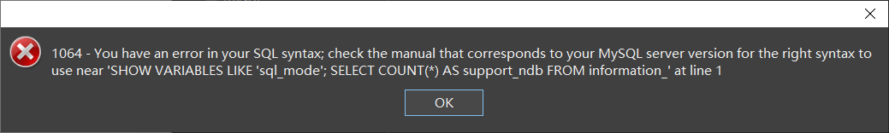

# 4.读写分离

## 读写分离介绍


​	MySQL读写分离基本原理是让master数据库处理写操作，slave数据库处理读操作。master将写操作的变更同步到各个slave节点。

​	MySQL读写分离能提高系统性能的原因在于：

​		1、物理服务器增加，机器处理能力提升。拿硬件换性能。

​		2、主从只负责各自的读和写，极大程度缓解X锁和S锁争用。

​		3、slave可以配置myiasm引擎，提升查询性能以及节约系统开销。

​		4、master直接写是并发的，slave通过主库发送来的binlog恢复数据是异步。

​		5、slave可以单独设置一些参数来提升其读的性能。

​		6、增加冗余，提高可用性。


## Proxy落地技术

### MySQL Proxy

​	mysql proxy是mysql官方提供的proxy程序，不过功能较弱，从14年开始就停止了更新，结束更新时也才是alpha版本。了解即可，不建议生产使用。

​	在mysql proxy中，主节点必须同时接收读写请求，从节点只接受读请求。

#### 实验搭建

1、实验配置

```
master 192.168.44.134:3306
slave  192.168.44.134:3307
proxy  192.168.44.134:4040
```

2、在master和slave上配置主从复制

3、启动mysql proxy代理程序

```shell
#2、下载mysql-proxy
wget https://downloads.mysql.com/archives/get/p/21/file/mysql-proxy-0.8.5-linux-glibc2.3-x86-64bit.tar.gz
#3、解压安装包
tar -zxvf mysql-proxy-0.8.5-linux-glibc2.3-x86-64bit.tar.gz
#4、修改解压后的目录
mv mysql-proxy-0.8.5-linux-glibc2.3-x86-64bit mysql-proxy-0.8.5
#5、进入mysql-proxy的目录
cd mysql-proxy-0.8.5
#6、创建目录
mkdir conf && mkdir logs
#7、添加环境变量
vi /etc/profile
#在文件的最后面添加一下命令
export PATH=$PATH:/root/mysql-proxy/bin
#8、执行命令让环境变量生效
source /etc/profile
#9、进入conf目录，写配置文件
vi mysql-proxy.conf
# 添加内容
[mysql-proxy]
user=root # 代理使用的用户名
admin-username=root # 主/从节点共享的管理员用户名
admin-password=mysql # 主/从节点共享的管理员密码
proxy-address=192.168.44.134:4040
proxy-backend-addresses=192.168.44.134:3306
proxy-read-only-backend-addresses=192.168.44.134:3307
proxy-lua-script=/opt/mysql-proxy-0.8.5/share/doc/mysql-proxy/rw-splitting.lua
log-file=/opt/mysql-proxy-0.8.5/logs/mysql-proxy.log
log-level=debug
daemon=true
keepalive=false
# 赋予配置文件660权限
chmod 660 mysql-proxy.conf
#10、开启mysql-proxy
mysql-proxy --defaults-file=/opt/mysql-proxy-0.8.5/conf/mysql-proxy.conf
#11、查看是否安装成功，打开日志文件
tail -100 /opt/mysql-proxy-0.8.5/logs/mysql-proxy.log
#内容如下：表示安装成功
2020-02-15 20:41:58: (critical) plugin proxy 0.8.5 started
2020-02-15 20:41:58: (debug) max open file-descriptors = 1024
2020-02-15 20:41:58: (message) proxy listening on port 192.168.44.134:4040
2020-02-15 20:41:58: (message) added read/write backend: 192.168.44.134:3306
2020-02-15 20:41:58: (message) added read-only backend: 192.168.44.134:3307
2020-02-15 20:41:58: (debug) now running as user: root (0/0)
```

4、连接代理，进行测试。

​	我搭建的环境，后端mysql是8.0版本。mysql proxy正确启动后，通过navicat从4040端口没有连接成功，报错`reading authorization packet`。查看mysql proxy日志没有信息，最终没有找到原因，也就没进行测试。


### Amoeba

#### 什么是amoeba

​	Amoeba(变形虫)项目，专注 分布式数据库 proxy 开发。座落与Client、DB Server(s)之间。对客户端透明。具有负载均衡、高可用、sql过滤、读写分离、可路由相关的query到目标数据库、可并发请求多台数据库合并结果。

主要解决：

- 降低数据切分带来的复杂多数据库结构
- 提供切分规则并降低数据切分规则给应用带来的影响
- 降低db与客户端的连接数
- 读写分离

#### 为什么要用Amoeba

​	目前要实现mysql的主从读写分离，主要有以下几种方案：

1. 通过程序实现，网上很多现成的代码，比较复杂，如果添加从服务器要更改多台服务器的代码

2. 通过mysql-proxy来实现，由于mysql-proxy的主从读写分离是通过lua脚本来实现，目前lua的脚本的开发跟不上节奏，而写没有完美的现成脚本，因此导致用于生产环境的话风险比较大，据网上很多人说mysql-proxy的性能不高

3. 自己开发接口实现，这种方案门槛高，开发成本高，不是一般的小公司能承担得起

4. 利用阿里巴巴的开源项目Amoeba来实现，具有负载均衡、高可用性、sql过滤、读写分离、可路由相关的query到目标数据库，并且安装配置非常简单

#### Amoeba实验搭建

1、安装jdk

2、下载amoeba对应的版本https://sourceforge.net/projects/amoeba/并解压

```shell
cd /opt && wget https://jaist.dl.sourceforge.net/project/amoeba/Amoeba%20for%20mysql/3.x/amoeba-mysql-3.0.5-RC-distribution.zip

unzip amoeba-mysql-3.0.5-RC-distribution.zip && rm -rf amoeba-mysql-3.0.5-RC-distribution.zip && cd amoeba-mysql-3.0.5-RC
```

3、在conf目录下创建amoeba的配置文件

`vi dbServers.xml`

```xml
<?xml version="1.0" encoding="gbk"?>

<!DOCTYPE amoeba:dbServers SYSTEM "dbserver.dtd">
<amoeba:dbServers xmlns:amoeba="http://amoeba.meidusa.com/">

		<!-- 
			Each dbServer needs to be configured into a Pool,
			If you need to configure multiple dbServer with load balancing that can be simplified by the following configu
ration:			 add attribute with name virtual = "true" in dbServer, but the configuration does not allow the element with n
ame factoryConfig			 such as 'multiPool' dbServer   
		-->
	
    <!-- dbServer定义一个mysql server实例。当前abstractServer用于指定一些公共配置，然后正真的两个实例server会继承abstractServer -->
	<dbServer name="abstractServer" abstractive="true">
		<factoryConfig class="com.meidusa.amoeba.mysql.net.MysqlServerConnectionFactory">
			<property name="connectionManager">${defaultManager}</property>
			<property name="sendBufferSize">64</property>
			<property name="receiveBufferSize">128</property>
			
            <!-- mysql ip -->
			<property name="ipAddress">192.168.44.134</property>
			
			<!-- mysql schema -->
			<property name="schema">msb</property>
			
			<!-- mysql user -->
			<property name="user">root</property>
			
			<property name="password">mysql</property>
		</factoryConfig>
		<!-- 连接池配置 -->
		<poolConfig class="com.meidusa.toolkit.common.poolable.PoolableObjectPool">
			<property name="maxActive">500</property>
			<property name="maxIdle">500</property>
			<property name="minIdle">1</property>
			<property name="minEvictableIdleTimeMillis">600000</property>
			<property name="timeBetweenEvictionRunsMillis">600000</property>
			<property name="testOnBorrow">true</property>
			<property name="testOnReturn">true</property>
			<property name="testWhileIdle">true</property>
		</poolConfig>
	</dbServer>
	
    <!-- 定义3307实例，名字是writedb，继承abstractServer -->
	<dbServer name="writedb"  parent="abstractServer">
		<factoryConfig>
			<!-- mysql port -->
			<property name="port">3307</property>
		</factoryConfig>
	</dbServer>
	
	<dbServer name="slave"  parent="abstractServer">
		<factoryConfig>
			<!-- mysql port -->
			<property name="port">3308</property>
		</factoryConfig>
	</dbServer>
    
    <!-- 创建一个虚拟后端服务，这个服务会负载均衡指定的servers -->
	<dbServer name="myslave" virtual="true">
		<poolConfig class="com.meidusa.amoeba.server.MultipleServerPool">
			<!-- Load balancing strategy: 1=ROUNDROBIN , 2=WEIGHTBASED , 3=HA-->
			<property name="loadbalance">1</property>
			
			<!-- Separated by commas,such as: server1,server2,server1 -->
			<property name="poolNames">slave</property>
		</poolConfig>
	</dbServer>
</amoeba:dbServers>
```

`vi amoeba.xml`

```xml
<?xml version="1.0" encoding="gbk"?>

<!DOCTYPE amoeba:configuration SYSTEM "amoeba.dtd">
<amoeba:configuration xmlns:amoeba="http://amoeba.meidusa.com/">

	<proxy>
		<!-- service class must implements com.meidusa.amoeba.service.Service -->
		<service name="Amoeba for Mysql" class="com.meidusa.amoeba.mysql.server.MySQLService">
			<!-- port -->
			<property name="port">8066</property>
			
			<!-- bind ipAddress -->
			<!-- 
			<property name="ipAddress">127.0.0.1</property>
			 -->
			
			<property name="connectionFactory">
				<bean class="com.meidusa.amoeba.mysql.net.MysqlClientConnectionFactory">
					<property name="sendBufferSize">128</property>
					<property name="receiveBufferSize">64</property>
				</bean>
			</property>
			
			<property name="authenticateProvider">
				<bean class="com.meidusa.amoeba.mysql.server.MysqlClientAuthenticator">
					
					<property name="user">root</property>
					
					<property name="password">mysql</property>
					
					<property name="filter">
						<bean class="com.meidusa.toolkit.net.authenticate.server.IPAccessController">
							<property name="ipFile">${amoeba.home}/conf/access_list.conf</property>
						</bean>
					</property>
				</bean>
			</property>
			
		</service>
		
		<runtime class="com.meidusa.amoeba.mysql.context.MysqlRuntimeContext">
			
			<!-- proxy server client process thread size -->
			<property name="executeThreadSize">128</property>
			
			<!-- per connection cache prepared statement size  -->
			<property name="statementCacheSize">500</property>
			
			<!-- default charset -->
			<property name="serverCharset">utf8</property>
			
			<!-- query timeout( default: 60 second , TimeUnit:second) -->
			<property name="queryTimeout">60</property>
		</runtime>
		
	</proxy>
	
	<!-- 
		Each ConnectionManager will start as thread
		manager responsible for the Connection IO read , Death Detection
	-->
	<connectionManagerList>
		<connectionManager name="defaultManager" class="com.meidusa.toolkit.net.MultiConnectionManagerWrapper">
			<property name="subManagerClassName">com.meidusa.toolkit.net.AuthingableConnectionManager</property>
		</connectionManager>
	</connectionManagerList>
	
	<!-- default using file loader -->
	<dbServerLoader class="com.meidusa.amoeba.context.DBServerConfigFileLoader">
		<property name="configFile">${amoeba.home}/conf/dbServers.xml</property>
	</dbServerLoader>
	
	<queryRouter class="com.meidusa.amoeba.mysql.parser.MysqlQueryRouter">
		<property name="ruleLoader">
			<bean class="com.meidusa.amoeba.route.TableRuleFileLoader">
				<property name="ruleFile">${amoeba.home}/conf/rule.xml</property>
				<property name="functionFile">${amoeba.home}/conf/ruleFunctionMap.xml</property>
			</bean>
		</property>
		<property name="sqlFunctionFile">${amoeba.home}/conf/functionMap.xml</property>
		<property name="LRUMapSize">1500</property>
		<property name="defaultPool">writedb</property>
		
        <!-- 指定哪些server提供读、写功能，可以严格控制后端服务提供的功能 -->
		<property name="writePool">writedb</property>
		<property name="readPool">myslave</property>
		<property name="needParse">true</property>
	</queryRouter>
</amoeba:configuration>
```

4、启动amoeba

```shell
/opt/amoeba-mysql-3.0.5-RC/bin/launcher
```

5、测试读写分离效果

```sql
--测试的sql
--在安装amoeba的服务器上登录mysql
mysql -h192.168.44.134 -uroot -pmysql -P8066
--分别在master、slave、amoeba上登录mysql
use msb
select * from user;
--在amoeba上插入数据
insert into user values(2,2);
--在master和slave上分别查看表中的数据
select * from user;
--将master上的mysql服务停止，继续插入数据会发现插入不成功，但是能够查询
--将master上的msyql服务开启，停止slave上的mysql，发现插入成功，但是不能够查询
```

> MySQL后端版本是8.0时，用客户端连接报语法错误，估计是版本兼容性问题
>
> 


### Mycat

#### 是什么

​	直接摘录《Mycat权威指南》中的一段话：

> 对于 DBA 来说，可以这么理解 Mycat：
>
> ​	Mycat 就是 MySQL Server，而 Mycat 后面连接的 MySQL Server，就好象是 MySQL 的存储引擎,如 InnoDB，MyISAM 等，因此，Mycat 本身并不存储数据，数据是在后端的 MySQL 上存储的，因此数据可靠性 以及事务等都是 MySQL 保证的，简单的说，Mycat 就是 MySQL 最佳伴侣，它在一定程度上让 MySQL 拥有了 能跟 Oracle PK 的能力。 
>
> 对于软件工程师来说，可以这么理解 Mycat：
>
> ​	Mycat 就是一个近似等于 MySQL 的数据库服务器，你可以用连接 MySQL 的方式去连接 Mycat（除了端 口不同，默认的 Mycat 端口是 8066 而非 MySQL 的 3306，因此需要在连接字符串上增加端口信息），大多数 情况下，可以用你熟悉的对象映射框架使用 Mycat，但建议对于分片表，尽量使用基础的 SQL 语句，因为这样能达到最佳性能，特别是几千万甚至几百亿条记录的情况下。
>
> 对于架构师来说，可以这么理解 Mycat：
>
> ​	Mycat 是一个强大的数据库中间件，不仅仅可以用作读写分离、以及分表分库、容灾备份，而且可以用于多 租户应用开发、云平台基础设施、让你的架构具备很强的适应性和灵活性，借助于即将发布的 Mycat 智能优化模 块，系统的数据访问瓶颈和热点一目了然，根据这些统计分析数据，你可以自动或手工调整后端存储，将不同的 表映射到不同存储引擎上，而整个应用的代码一行也不用改变。

​	这是一个功能极其强大、生命力至今一直旺盛的项目。以后再玩吧。

> [官方网址](http://mycat.io/)