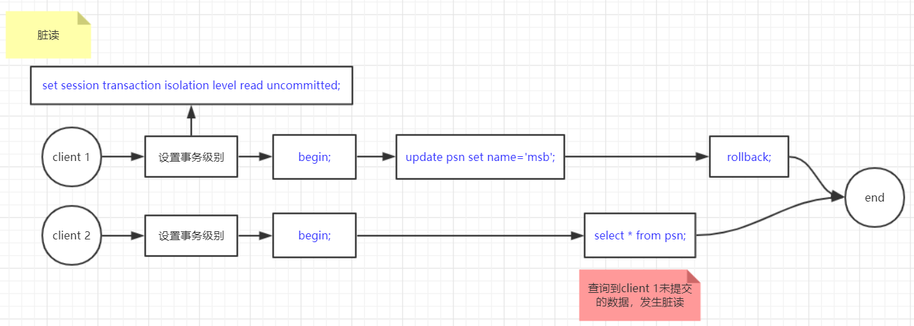
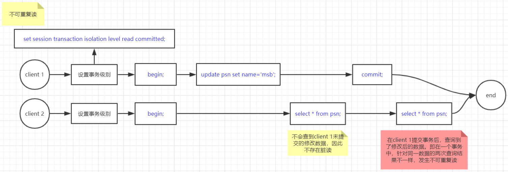
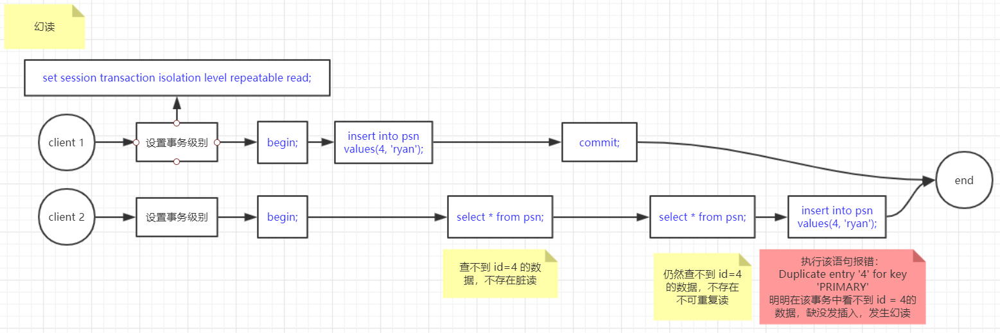
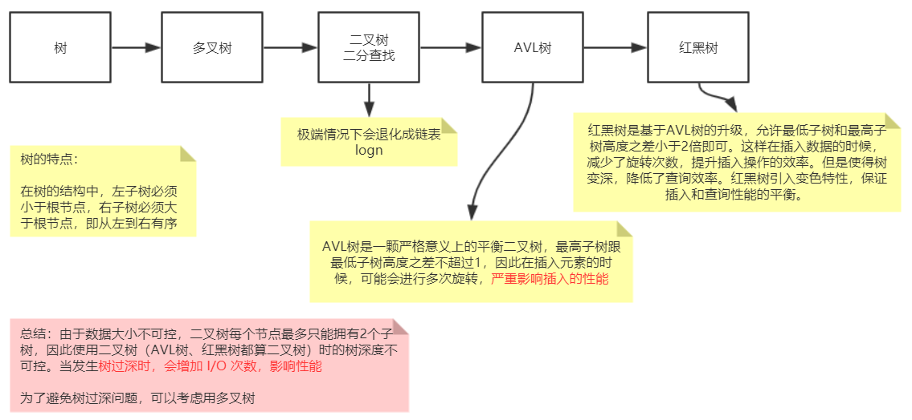
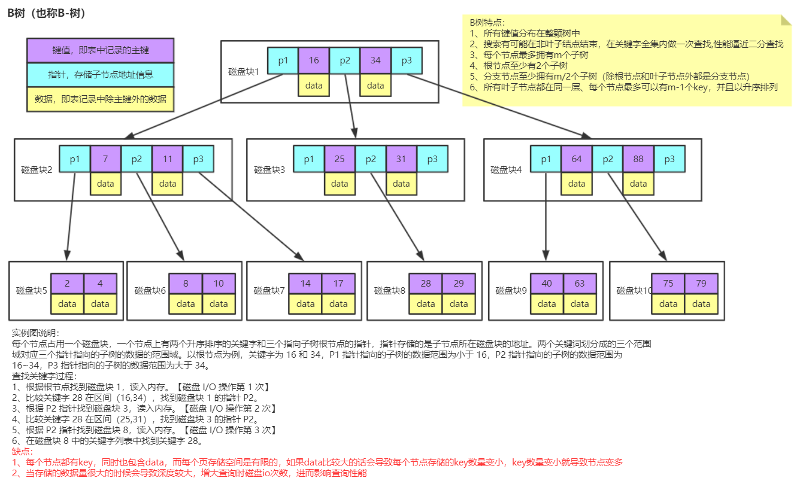
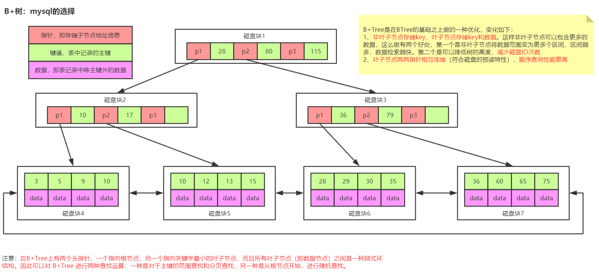
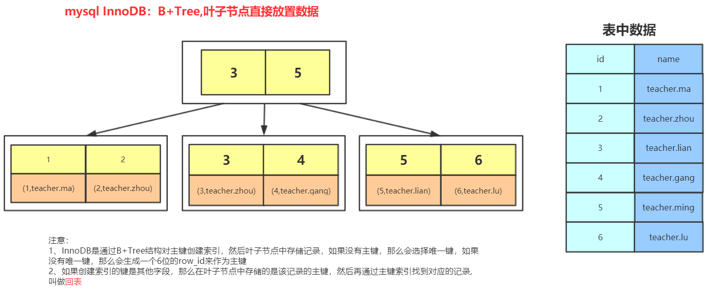
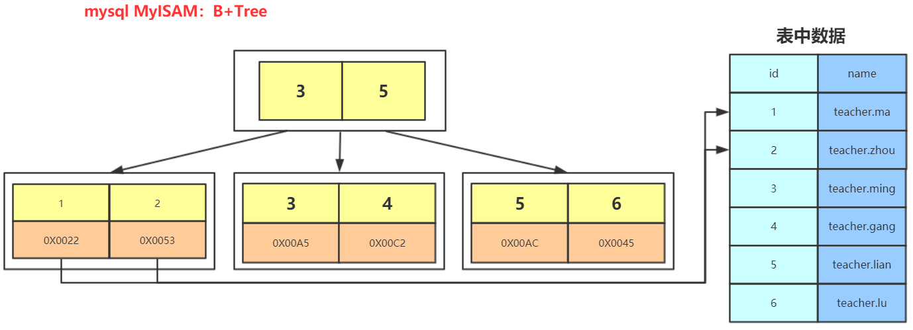

## 事务

​	事务（Transaction）是一个操作序列（集合）。这些操作要么都做，要么都不 做，是一个不可分割的工作单位，是数据库环境中的逻辑工作单位。

### 事务控制语句

​	事务控制语句包含以下 7 个关键字：

- `BEGIN` 或 `START TRANSACTION` 显式地开启一个事务
- `COMMIT` 或 `COMMIT WORK`，二者等价，会提交事务，并使已对数据库进行的所有修改成为永久性的
- `ROLLBACK` 或 `ROLLBACK WORK`，二者等价，会进行回滚。回滚会结束用户的事务，并撤销正在进行的所有未提交的修改
- `SAVEPOINT identifier`，允许在事务中创建一个保存点，一个事务中可以有多个 `SAVEPOINT`
- `RELEASE SAVEPOINT identifier` 删除一个事务的保存点，当没有指定的保存点时，执行该语句会抛出一个异常
- `ROLLBACK TO identifier` 把事务回滚到保存点
- `SET TRANSACTION` 用来设置事务的隔离级别。`InnoDB` 存储引擎提供事务的隔离级别有`READ UNCOMMITTED`、`READ COMMITTED`、`REPEATABLE READ` 和 `SERIALIZABLE`


​	事务的结束可由以下操作进行触发：

- 用户显式执行 `commit` 语句提交操作或 `Rollback` 语句回退

- 开启了自动提交，执行了DML语句后

  > 通过`SET AUTOCOMMIT=1` 可以设置开启自动提交，但是一般会关闭自动提交，因为效率太低

- 执行DDL语句，事务会自动提交

- 用户正常断开连接时，Transaction自动提交

- 系统崩溃或断电时事务自动回退


​	一个事务语句示例：

```sql
-- 开始事务
begin;
insert into emp2(empno, ename) values(1111, 'ryan');
insert into emp2(empno, ename) values(2222, 'jenny');
-- 创建保存点 s1
savepoint s1;
delete from emp2 where empno = 1111;
-- 回滚 s1 保存点之后的语句
rollback to s1;
-- 创建保存点 s2
savepoint s2;
delete from emp2 where empno = 2222;
-- 删除保存点 s2
release savepoint s2;
-- 提交事务
commit;
-- 查看 emp2 数据，1111 由于回滚，因此没有被删除。而 2222 已被删除
select * from emp2;
```


### 数据状态

提交或回滚前数据的状态：

- 以前的数据可恢复
- 当前的用户可以看到DML操作的结果（新的数据刷在了内存里）
- 其他用户不能看到DML操作的结果（其它用户从磁盘获取数据，因此看不到数据修改）
- 被操作的数据被锁住，其他用户不能修改这些数据

提交后数据的状态（和提交前数据状态正好相反）：

- 数据的修改被永久写在数据库中
- 数据以前的状态永久性丢失
- 所有的用户都能看到操作后的结果
- 记录锁被释放，其他用户可操作这些记录

回滚后数据的状态：

- 修改的数据被回退
- 恢复数据以前的状态
- 行级锁被释放


### ACID特性

- A：原子性，表示不可分割，一个原子事务要么全部完成，要么全部失败
- C：一致性，代表了底层数据存储的完整性。当经过N多个操作之后，数据的状态不会改变。
- I：隔离性，各个事务之间相互不会产生影响（隔离级别），严格的隔离性会导致效率降低。在某些场景下为了提高程序的执行效率，需要降低隔离的执行级别
- D：持久性，所有数据的修改都必须要持久化到存储设备中，不会因为应用程序的关闭而导致数据丢失

​	这四个特性，其实都是为了保证数据的一致性，因此**一致性**是最终的追求


### 锁机制

​	事务可以保证在并发访问下，数据的一致性，那么事务是如何做到数据一致性的？底层是用过锁机制实现的。

​	加锁时需要考虑锁 粒度 问题，常见的数据库锁粒度包括：

- 数据库
- 表
- 行

​	一般情况下，锁粒度越小，效率越高，逻辑控制越复杂。粒度越大，效率越低，逻辑控制越简单。在实际工作环境中，大部分操作都是行级锁


### 隔离级别

​	关系型数据库常存在四种事务隔离级别：

- `READ UNCOMMITTED`：读未提交
- `READ COMMITTED`：读已提交
- `REPEATABLE READ` ：可重复读（默认值）
- `SERIALIZABLE`：序列化，串行执行，读操作一定要等写操作执行完成

​	从上往下隔离级别越来越高，意味着数据越来越安全

>  如何查看当前 session 的隔离级别是什么？
>
>  8.0之前：`select @@tx_isolation;`
>
>  8.0之后：`select @@transaction_isolation;`
>
>  如何设置事务的隔离级别？
>
>  `set global transaction isolation level read uncommitted`
>
>  执行完该语句后，当前 session 的隔离级别不会立刻更新，需要重新开连接，或者做 session 级别的调整：``set session transaction isolation level read uncommitted``

​	不同的隔离级别会产生不同的问题，具体有如下 3 种数据不一致问题：

- 脏读：多个用户获取相同数据时，发生返回的数据不一致情况

- 不可重复读：在同一个事务里面，两次读取的数据值不一样

- 幻读：在事务中，插入或删除事务中不存在的数据时，发生错误，报错信息为数据已存在，但是该数据在当前事务中是看不到的

  > 不可重复读和幻读的差别在于侧重点不同，前者侧重于修改，后者侧重于新增、删除

| 隔离级别 / 存在的问题 | 脏读 | 不可重复读 | 幻读 |
| --------------------- | ---- | ---------- | ---- |
| `READ UNCOMMITTED`    | 存在 | 存在       | 存在 |
| `READ COMMITTED`      |      | 存在       | 存在 |
| `REPEATABLE READ`     |      |            | 存在 |
| `SERIALIZABLE`        |      |            |      |

​	什么操作下会产生上述的 3 种数据不一致问题？

1. 创建一个实验环境


```sql
set autocommit = 0;

create database tran;
create table psn(id int primary key,name varchar(10)) engine=innodb;

insert into psn values(1,'zhangsan');
insert into psn values(2,'lisi');
insert into psn values(3,'wangwu');

commit;
```

2. 产生脏读



```sql
-- 针对当前 session 级别的配置事务隔离
set session transaction isolation level read uncommitted;

begin;
update psn set name='msb';
select * from psn;
rollback;
```

3. 产生不可重复读



```sql
set session transaction isolation level read committed;

begin;
update psn set name='msb';
select * from psn;
commit;
```

4. 产生幻读



```sql
set session transaction isolation level repeatable read;

begin;
insert into psn values(4, 'ryan');
select * from psn;
commit;
insert into psn values(4, 'ryan');
```

#### 如何解决幻读

​	除了把事务隔离级别改成`SERIALIZABLE`外，还可以通过间隙锁解决幻读问题

​	<font color='blue'>间隙锁(Gap Lock)</font>：锁住两行纪录之间的空隙，以避免数据新增、删除和更新操作。只在RR级别下有用，解决幻读问题。

​	<font color='blue'>Next-Key Lock</font>：单行锁（Record Lock）+间隙锁（Gap Lock）合起来就叫`Next-Key Lock`。

​	通过`innodb_locks_unsafe_for_binlog`参数配置为0，代表开启间隙锁；值为1代表关闭间隙锁，在MySQL8.0之前默认值为0，该参数在 8.0 版本被移除，说明一直是打开的。

解决幻读的实验步骤如下：


```sql
set session transaction isolation level repeatable read;

begin;
select * from psn for update;
insert into psn values(5, 'alex');
select * from psn;
commit;
```

## 索引

​	索引是为了加快对数据的搜索速度而设立的。索引是方案（schema）中的一个数据库对象，与表独立存放。

​	索引的作用：在数据库中用来加速对表的查询，通过使用快速路径访问方法快速定位数据，减少了磁盘的I/O

​	索引创建的两种情况：

1. 自动: 当在表上定义一个 `PRIMARY KEY` 或者 `UNIQUE` 约束条件时，数据库自动创建一个对应的唯一索引
2. 手动: 用户可以创建索引以加速查询

索引要点：

- 索引改善检索操作的性能，但降低数据插入、修改和删除的性能。在执行这些操作时，MySQL 必须动态地更新索引

- 索引数据可能要占用大量的存储空间

- 并非所有的数据都适合于索引。唯一性不好的数据（如省）从索引得到的好处不比具有更多可能值的数据（如姓名）从索引得到的好处多

- 索引用于数据过滤和数据排序。如果经常以某种特定的顺序排序数据，则该数据可能是索引的备选

- 可以在索引中定义多个列（如省加城市），这样的索引只在以省加城市的顺序排序时有用。如果想按城市排序，则这种索引没有用处

- 如果 sql 语句中存在运算，那么索引会无效，因此要避免索引无效的情况

  ```mysql
  mysql> explain select * from it where id=4;
  +----+-------------+-------+------------+-------+---------------+---------+---------+-------+------+----------+-------+
  | id | select_type | table | partitions | type  | possible_keys | key     | key_len | ref   | rows | filtered | Extra |
  +----+-------------+-------+------------+-------+---------------+---------+---------+-------+------+----------+-------+
  |  1 | SIMPLE      | it    | NULL       | const | PRIMARY       | PRIMARY | 4       | const |    1 |   100.00 | NULL  |
  +----+-------------+-------+------------+-------+---------------+---------+---------+-------+------+----------+-------+
  1 row in set (0.08 sec)
  
  mysql> explain select * from it where id + 1 = 4;
  +----+-------------+-------+------------+------+---------------+------+---------+------+------+----------+-------------+
  | id | select_type | table | partitions | type | possible_keys | key  | key_len | ref  | rows | filtered | Extra       |
  +----+-------------+-------+------------+------+---------------+------+---------+------+------+----------+-------------+
  |  1 | SIMPLE      | it    | NULL       | ALL  | NULL          | NULL | NULL    | NULL |    5 |   100.00 | Using where |
  +----+-------------+-------+------------+------+---------------+------+---------+------+------+----------+-------------+
  1 row in set (0.09 sec)
  ```

### 操作

```sql
-- 查询索引
show index from emp;
-- 创建索引的3种方式
create index i_ename on emp(ename);
alter table emp add key(ename);
alter table emp add index [index_name](ename);
-- 删除索引
drop index i_ename on emp;
```

### 分类

​	mysql 索引分为五类：

- 主键索引

  - 主键是一种唯一性索引，但是不能为空
  - 每个表最多只能有一个主键（一个主键不代表一个列）
  - 当表没有主键时，会找唯一键，建立唯一索引
  - 当表没有主键也没有唯一键时，mysql 自动创建一个`rowid`列作为主键并建立主键索引。该列对用户不可见，对系统可见
  - 主键无特殊情况时，建议设置“自动递增”，这样主键索引维护起来成本较低，不存在页分裂、页合并等影响性能的操作

  > 当按照索引顺序插入时，page的填充率能达到15/16 ， 而乱序插入时只能到略大于 1/2 的填充率。
  >
  > 会带来10%的TPS提升，并减少50%的空间浪费。

  

  - 主键的"自动递增"功能，通过"自增锁"实现

- 唯一索引

  - 索引列所有值不能相同，值可以为空

- 普通索引

  - 基本的索引类型，值可以为空
  - 存在回表操作，需要遍历两次 B+ 树
  - <font color='blue'>覆盖索引</font>：**要查询的列被所建的索引覆盖**。建立索引后，如果要查询非主键字段，则需要回表。如果只查询主键值或者索引的值（如 sql 语句是`select id from emp where ename='KING'`），此时直接可以从索引数据中获取，这就称为 "覆盖索引"。在InnoDB中因为覆盖索引少了一次回表，因此效率会提高。

- 全文索引

  - 索引类型为“FULLTEXT”，可在“varchar”、“char”、“text”类型上创建
  - 5.6之前，全文索引只存在与`MyISAM`中；5.6 开始，`Innodb`也开始支持全文索引
  - 比较少用，本身 mysql 做大文本存储就很少用

- 组合索引

  - 多列值组成一个索引，专门用于组合搜索
  - <font color='blue'>最左匹配原则</font>：组合索引会对多个列建立索引，这多个列的顺序是有说法的。如创建一个`name`、`age`顺序的索引。此时存在一个细节点，如果用`name`和`age`组合查询时，这个索引一定能起作用。当只根据`name`查询时，因为匹配索引的最左列`name`，因此这个索引也能起作用。当只根据`age`查询时，不满足最左匹配，因此该索引不起作用

  > 注意：`select * from text where name like '%a'`是不会走name索引的，而`select * from text where name like 'a%'`会走name索引。
  >
  > 
  >
  > 如果有个场景，存在根据`name`的查询、根据`name`和`age`的查询、根据`age`的查询，那么方案就有两种
  >
  > 1：组合索引`name age`，普通索引`age`
  >
  > 2：组合索引`age name`，普通索引`name`
  >
  > 如何选择？从空间考虑
  >
  > 从效率上考虑，两者几乎无差别。从空间上考虑，因为`name`字段长度长，因此方案1 更省空间，1 更优

> <font color='blue'>索引下推</font>，5.7版本开始支持，前提是必须存在组合索引
>
> 假设我们有一个`user`表，建立了`(username, age, sex)`的联合索引。此时有这样一个语句`select * from user where username like 'M%' and sex = 1`，这条语句的执行有 2 种方式：
>
> 1. 根据联合索引，先找到名字符合条件的索引，然后回表获取整行数据，最后根据`sex`进行删选
> 2. 根据联合索引，先找到满足名字条件的索引，然后直接筛选符合`sex`的索引（因为联合索引里有sex的值），最后回表获取整行数据
>
> 显然 2 回表时查询的全行数据较少，效率更高，这就是 mysql 的索引下推。默认索引下推是开启的，可通过`select @@optimizer_switch;`查询是否开启，通过`SET global optimizer_switch = 'index_condition_pushdown=off';`可以关闭索引下推
>
> 注意：如果语句是`select * from user where username like 'M%' and age > 18`，那么直接利用联合索引`(username, age, sex)`和最左匹配原则，直接筛选出了符合`username like 'M%' and age > 18`的数据

### 索引维护

​	索引在插入新的值的时候，为了维护索引的有序性，必须要维护， 在维护索引的时候需要需要分以下集中情况：

- 如果插入一个比较大的值，直接插入即可，几乎没有成本
- 如果插入的是中间的某一个值，需要逻辑上移动后续的元素，空出位置
- 如果需要插入的数据页满了，就需要单独申请一个新的数据页，然后移动部分数据过去，叫做页分裂，此时性能会受影响，同时空间的使用率也会降低，除了页分裂之外还包含页合并

​	因此，尽量使用**自增主键**作为索引


### 基础知识

#### 局部性原理

​	程序和数据的访问都由聚集成群的倾向，在一段时间内，仅使用其中一小部分（称为空间局部性），或者最近访问过的程序代码和数据，很快又被访问的可能性很大（称为空间局部性）

#### 磁盘预读

​	页是存储器的逻辑块，OS 往往将主存和存储区分割为连续的大小相等的块，每个存储块称为一页（也叫page，通常为 4k），主存和磁盘以页为单位交换数据

​	预读长度一般为页的整数倍

#### 提升I/O的优化方向

1. 降低 I/O 发生次数
2. 降低每次 I/O 读取的数据量


### 面试题

​	mysql 索引是面试高频问题，因此直接通过面试题，来深度解析索引

#### 1. 索引存储在哪里？

​	要想知道索引存在哪里，就必须知道存储引擎是什么。存储引擎存储了 mysql 的所有数据（包括索引、表结构、表数据），不同的存储引擎会有不同的文件格式，不同的存放位置，因此按照存方式可将索引分为两类：

- 聚簇索引：数据和索引放在一个文件里（innodb）

  - `.frm`存放表结构
  - `.ibd`存放数据和索引

  > `innodb`存储引擎有一个系统参数可配置`innodb_file_per_table`，当开启后`set GLOBAL innodb_file_per_table=on;`，也就是启用`InnoDB`的独立表空间模式，此时才会为每个单独的表创建一份`.ibd`数据文件。如果不开启，则将数据文件放到系统表空间里，即`${date-dir}/ibdata1`文件

- 非聚簇索引：数据和索引放在不同文件（MyISAM）

  - `.frm`存放表结构
  - `.MYI`存放索引数据
  - `.MYD`存放实际数据

> 从 8.0 开始，`.frm`文件已经被移除了，表结构信息放在了元数据表`information_schema`中

​	**总结**：存储引擎是`innodb`和`MyISAM`时，索引存在磁盘上；存储引擎是`memory`时，索引存在内存中


#### 2. mysql 索引底层使用的数据结构是什么？为什么不用哈希表、二叉树、AVL树、红黑树、B树？








> B-tree和B+tree的最大区别是，B+tree叶子节点间存在双向指针。这是MySQL官方文档里说的

​	不同的存储引擎，B+树的实现略有不同。在`InnoDB`中，一个磁盘块默认大小是16k，由于数据和索引在一个文件里，因此叶子节点直接存放了整条数据。在`MyISAM`中，因为数据和索引不在一个文件里，因此叶子节点存放的是地信息址，地址指向了数据所在位置。





> <font color='blue'>回表</font>：默认的当我们创建了一个主键或者唯一键时，mysql 会自动为该列创建索引。如果我们手动的给列 A 创建了索引，A 列索引也会以B+树进行文件存储，此时叶子节点存储的不是整行数据，而是该行数据的主键。当根据 A 列查找数据时，会先根据 A 列的索引找到对应行的主键，然后去主键索引结构里找到整行数据，这个过程叫做"回表"。回表只会出现在`innodb`中，为了节省空间。而在MyISAM中叶子节点直接存储了行数据的地址，根本不存在为了节省空间而存储索引后进行回表操作。

