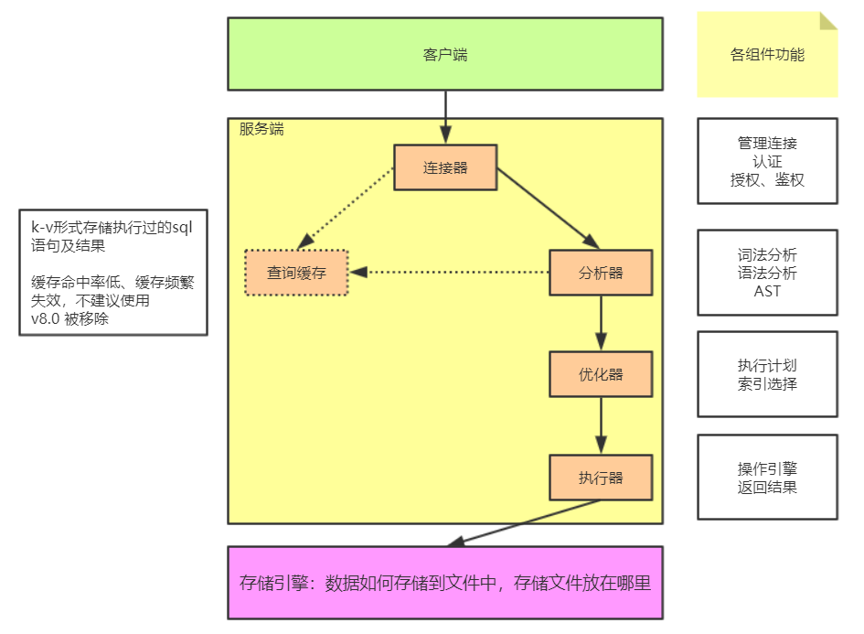

# 1.架构

​	MySQL架构图如下：

## 服务端组件

### 连接器

​	连接器负责跟客户端建立连接，获取权限、维持和管理连接

- 用户名密码验证
- 查询权限信息，分配对应的权限
- 可以使用`show processlist`查看当前存在的连接
- 如果太长时间没有动静，就会自动断开，通过`wait_timeout`控制，默认8小时

​	连接可以分为两类：

- 长连接：推荐使用，在长时间未使用的情况下要断开连接，否则占用服务端资源
- 短链接

### 查询缓存

​	当执行查询语句的时候，会先去查询缓存中查看结果，之前执行过的 sql 语句及其结果可能以 key-value 的形式存储在缓存中，如果能找到则直接返回，如果找不到，就继续执行后续的阶段。

​	但是不推荐使用查询缓存：

- 查询缓存的失效比较频繁，只要表更新，缓存就会清空
- 缓存对应新更新的数据命中率比较低

​	在 8.0 版本开始，查询缓存被移除

### 分析器

​	词法分析：Mysql 需要把输入的字符串进行识别，每个部分代表什么意思

- 把字符串 T 识别成 表名 T
- 把字符串 ID 识别成 列ID

​	词法分析：根据语法规则判断 sql 语句是否满足 mysql 的语法，如果不符合就会报错`You have an error in your SQL synta`

### 优化器

​	在具体执行 sql 语句之前，要先经过优化器的处理，不同的执行方式对 sql 语句的执行效率影响很大

- 当表中有多个索引的时候，决定用哪个索引
- 当 sql 语句需要做多表关联的时候，决定表的连接顺序
- 等等的各种优化方式

​	优化分为两类：

- `RBO`：基于规则的优化
- `CBO`：基于成本的优化（常用）

### 执行器

​	执行器和存储引擎通信，按照 sql 优化器生成的执行计划，有机的调用存储、索引、并发等模块，实现各种计划结点算法来完成数据的读取或者修改，并将结果返回的过程

## 存储引擎

​	存储引擎将决定数据如何存储、数据用什么文件存储以及存储文件放在哪里。存储引擎很重要，在下一节单独看