# 3.常用对象

## 约束

​	当我们创建表的时候，同时可以指定所插入数据的一些规则，比如说某个字段不能为空值，某个字段的值（比如年龄）不能小于零等， 这些规则称为约束。约束是在表上强制执行的数据校验规则

​	常用的约束有以下 7 种：

- `NOT NULL`：非空
- `UNIQUE`：唯一键
- `PRIMARY KEY`：主键，包含了唯一、非空约束
- `FOREIGN KEY`：外键
- `DEFAULT`：默认值约束
- `AUTO_INCREMENT`：值自增长
- `CHECK`：自定义检查约束

​	在新建表的时候，可以指定约束

```sql
CREATE TABLE student (
    stu_id INT ( 10 ) PRIMARY KEY auto_increment,
    NAME VARCHAR ( 20 ) NOT NULL,
    age INT ( 3 ) CHECK ( age > 0 AND age < 150 ),
    hiredate date,
    grade VARCHAR ( 10 ) DEFAULT 1,
    classes VARCHAR ( 10 ),
    email VARCHAR ( 50 ) UNIQUE,
    deptno INT ( 2 ),
    FOREIGN KEY ( deptno ) REFERENCES dept ( deptno ) 
)
```

​	创建外键的时候，可以指定级联删除/  级联更新方式，语法：`FOREIGN KEY (column_name) REFERENCES tabel_name(column_name) [ON DELETE [RESTRICT|CASCADE|SET NULL]] [ON UPDATE [RESTRICT|CASCADE|SET NULL]]`，不指定级联操作方式则是默认值`RESTRICT`

- `restrict`：也叫做`No Action`，只有当依赖表中没有一个外键值与要删除的主表中主键值相对应时，才可执行删 除操作（默认值）
- `cascade `：将依赖表中所有外键值与主表中要删除的主键值相对应的记录一起删除
- `set null`：将依赖表中所有与主表中被删除的主键值相对应的外键值设为 null

### 增删

​	在表创建好后，可以通过命令进行约束的增、删，但**不能修改约束**

`alter table [schema.]table_name add constraint con_name unique(column_name)`

`alter table [schema.]table_name drop constraint com_name [cascade]`

> 在创建表的时候直接将各个表的约束条件添加好，如果包含外键约束的话，最好先把外键关联表的数据优先插入

### 查询

​	约束信息存放在 information_schema 数据库的 table_constraints 表中，因此通过普通的查表语句就可以得到指定表上的约束。

​	`select * from information_schema.table_constraints where table_name='student';`


## 视图

### 定义

​	视图(view)，也称虚表, 不占用物理空间，这个也是相对概念，因为视图本身的定义语句还是要存储在数据字典里的。视图只有逻辑定义，每次使用的时候,，只是重新执行SQL

​	视图是从一个或多个实际表中获得的，这些表的数据存放在数据库中。那些用于产生视图的 表叫做该视图的基表。一个视图也可以从另一个视图中产生。

​	视图的定义存在数据库中，与此定义相关的数据并没有再存一份于数据库中。通过视图看到 的数据存放在基表中。

​	视图看上去非常象数据库的物理表，对它的操作同任何其它的表一样。当通过视图修改数据时，实际上是在改变基表中的数据；相反地，基表数据的改变也会自动反映在由基表产生的视图中。

### 语法

```sql
/* 创建视图
CREATE [OR REPLACE] VIEW view
[(alias[, alias]...)]
AS subquery
[WITH READ ONLY];
*/ 
create or replace view v_avg_sal as select deptno, avg(sal) asal from emp group by deptno;
--使用视图，直接用视图名称代替原来的 sql 语句
select * from emp e, v_avg_sal t where e.sal > t.asal and t.deptno = e.deptno;

--查找视图的sql语句
SELECT view_definition FROM information_schema.views WHERE table_name = 'v_avg_sal';

--查找视图表内容
select * from v_avg_sal;

--查看所有视图的信息
show table status where comment ='view'

--更改视图数据，和更改表数据一样
create view v_emp as select * from emp;
insert into v_emp(empno, ename) values(1111,'Ryan');
select * from emp;

--删除视图
drop view v_avg_sal;

```

### 注意点	

- 视图是一种虚表，不占物理空间，通过视图看到的数据都来自于基表

- 修改视图的时候，也会修改对应基表数据。同样，修改基表也会体现在视图中

- 若一个视图依赖于多个基本表，则一次修改或删除该视图只能修改一个基本表的数据，否则 sql 语句执行会报错`Can not modify more than one base table through a join view 'dept.v_emp_dept'`

- 当视图执行的语句本身就需要执行时，利用视图是不会影响查询效率的。除非进行了多余的语句执行，会影响效率，比如下面一个例子，emp 其实被查询了两次。

  ```sql
  create v_emp as select * from emp;
  --此处视图其实是查询了两次emp
  select * from v_emp;
  --相当于以下语句
  select * from (select * from emp) e;
  ```


## 事务

​	事务（Transaction）是一个操作序列（集合）。这些操作要么都做，要么都不 做，是一个不可分割的工作单位，是数据库环境中的逻辑工作单位。

### 事务控制语句

​	事务控制语句包含以下 7 个关键字：

- `BEGIN` 或 `START TRANSACTION` 显式地开启一个事务
- `COMMIT` 或 `COMMIT WORK`，二者等价，会提交事务，并使已对数据库进行的所有修改成为永久性的
- `ROLLBACK` 或 `ROLLBACK WORK`，二者等价，会进行回滚。回滚会结束用户的事务，并撤销正在进行的所有未提交的修改
- `SAVEPOINT identifier`，允许在事务中创建一个保存点，一个事务中可以有多个 `SAVEPOINT`
- `RELEASE SAVEPOINT identifier` 删除一个事务的保存点，当没有指定的保存点时，执行该语句会抛出一个异常
- `ROLLBACK TO identifier` 把事务回滚到保存点
- `SET TRANSACTION` 用来设置事务的隔离级别。`InnoDB` 存储引擎提供事务的隔离级别有`READ UNCOMMITTED`、`READ COMMITTED`、`REPEATABLE READ` 和 `SERIALIZABLE`


​	事务的结束可由以下操作进行触发：

- 用户显式执行 `commit` 语句提交操作或 `Rollback` 语句回退

- 开启了自动提交，执行了DML语句后

  > 通过`SET AUTOCOMMIT=1` 可以设置开启自动提交，但是一般会关闭自动提交，因为效率太低

- 执行DDL语句，事务会自动提交

- 用户正常断开连接时，Transaction自动提交

- 系统崩溃或断电时事务自动回退


​	一个事务语句示例：

```sql
-- 开始事务
begin;
insert into emp2(empno, ename) values(1111, 'ryan');
insert into emp2(empno, ename) values(2222, 'jenny');
-- 创建保存点 s1
savepoint s1;
delete from emp2 where empno = 1111;
-- 回滚 s1 保存点之后的语句
rollback to s1;
-- 创建保存点 s2
savepoint s2;
delete from emp2 where empno = 2222;
-- 删除保存点 s2
release savepoint s2;
-- 提交事务
commit;
-- 查看 emp2 数据，1111 由于回滚，因此没有被删除。而 2222 已被删除
select * from emp2;
```


### 数据状态

提交或回滚前数据的状态：

- 以前的数据可恢复
- 当前的用户可以看到DML操作的结果（新的数据刷在了内存里）
- 其他用户不能看到DML操作的结果（其它用户从磁盘获取数据，因此看不到数据修改）
- 被操作的数据被锁住，其他用户不能修改这些数据

提交后数据的状态（和提交前数据状态正好相反）：

- 数据的修改被永久写在数据库中
- 数据以前的状态永久性丢失
- 所有的用户都能看到操作后的结果
- 记录锁被释放，其他用户可操作这些记录

回滚后数据的状态：

- 修改的数据被回退
- 恢复数据以前的状态
- 行级锁被释放


### ACID特性

- A：原子性，表示不可分割，一个原子事务要么全部完成，要么全部失败
- C：一致性，代表了底层数据存储的完整性。当经过N多个操作之后，数据的状态不会改变。
- I：隔离性，各个事务之间相互不会产生影响（隔离级别），严格的隔离性会导致效率降低。在某些场景下为了提高程序的执行效率，需要降低隔离的执行级别
- D：持久性，所有数据的修改都必须要持久化到存储设备中，不会因为应用程序的关闭而导致数据丢失

​	这四个特性，其实都是为了保证数据的一致性，因此**一致性**是最终的追求


### 锁机制

​	事务可以保证在并发访问下，数据的一致性，那么事务是如何做到数据一致性的？底层是用过锁机制实现的。

​	加锁时需要考虑锁 粒度 问题，常见的数据库锁粒度包括：

- 数据库
- 表
- 行

​	一般情况下，锁粒度越小，效率越高，逻辑控制越复杂。粒度越大，效率越低，逻辑控制越简单。在实际工作环境中，大部分操作都是行级锁


### 隔离级别

​	关系型数据库常存在四种事务隔离级别：

- `READ UNCOMMITTED`：读未提交
- `READ COMMITTED`：读已提交
- `REPEATABLE READ` ：可重复读（默认值）
- `SERIALIZABLE`：序列化，串行执行，读操作一定要等写操作执行完成

​	从上往下隔离级别越来越高，意味着数据越来越安全

>  如何查看当前 session 的隔离级别是什么？
>
>  8.0之前：`select @@tx_isolation;`
>
>  8.0之后：`select @@transaction_isolation;`
>
>  如何设置事务的隔离级别？
>
>  `set global transaction isolation level read uncommitted`
>
>  执行完该语句后，当前 session 的隔离级别不会立刻更新，需要重新开连接，或者做 session 级别的调整：``set session transaction isolation level read uncommitted``

​	不同的隔离级别会产生不同的问题，具体有如下 3 种数据不一致问题：

- 脏读：多个用户获取相同数据时，发生返回的数据不一致情况

- 不可重复读：在同一个事务里面，两次读取的数据值不一样

- 幻读：在事务中，插入或删除事务中不存在的数据时，发生错误，报错信息为数据已存在，但是该数据在当前事务中是看不到的

  > 不可重复读和幻读的差别在于侧重点不同，前者侧重于修改，后者侧重于新增、删除

| 隔离级别 / 存在的问题 | 脏读 | 不可重复读 | 幻读 |
| --------------------- | ---- | ---------- | ---- |
| `READ UNCOMMITTED`    | 存在 | 存在       | 存在 |
| `READ COMMITTED`      |      | 存在       | 存在 |
| `REPEATABLE READ`     |      |            | 存在 |
| `SERIALIZABLE`        |      |            |      |

​	什么操作下会产生上述的 3 种数据不一致问题？

1. 创建一个实验环境

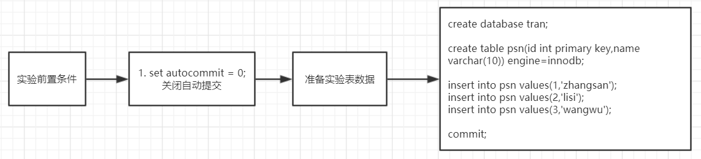

```sql
set autocommit = 0;

create database tran;
create table psn(id int primary key,name varchar(10)) engine=innodb;

insert into psn values(1,'zhangsan');
insert into psn values(2,'lisi');
insert into psn values(3,'wangwu');

commit;
```

2. 产生脏读

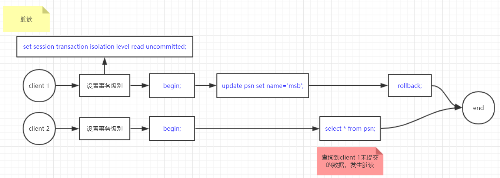

```sql
-- 针对当前 session 级别的配置事务隔离
set session transaction isolation level read uncommitted;

begin;
update psn set name='msb';
select * from psn;
rollback;
```

3. 产生不可重复读

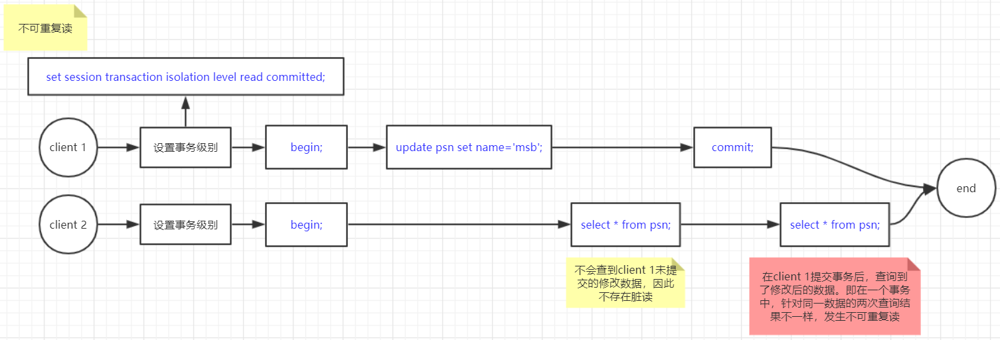

```sql
set session transaction isolation level read committed;

begin;
update psn set name='msb';
select * from psn;
commit;
```

4. 产生幻读

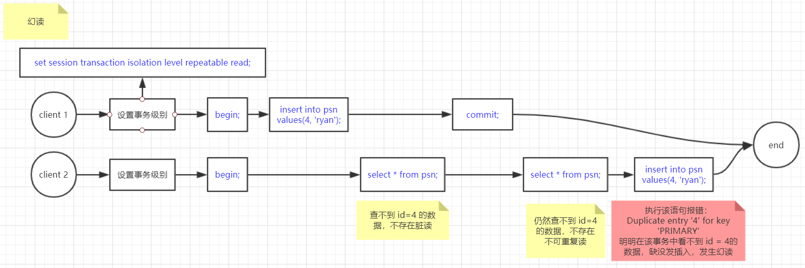

```sql
set session transaction isolation level repeatable read;

begin;
insert into psn values(4, 'ryan');
select * from psn;
commit;
insert into psn values(4, 'ryan');
```

#### 如何解决幻读

​	除了把事务隔离级别改成`SERIALIZABLE`外，还可以通过间隙锁解决幻读问题

​	<font color='blue'>间隙锁(Gap Lock)</font>：锁住两行纪录之间的空隙，以避免数据新增、删除和更新操作。只在RR级别下有用，解决幻读问题。

​	<font color='blue'>Next-Key Lock</font>：单行锁（Record Lock）+间隙锁（Gap Lock）合起来就叫`Next-Key Lock`。

​	通过`innodb_locks_unsafe_for_binlog`参数配置为0，代表开启间隙锁；值为1代表关闭间隙锁，在MySQL8.0之前默认值为0，该参数在 8.0 版本被移除，说明一直是打开的。

解决幻读的实验步骤如下：

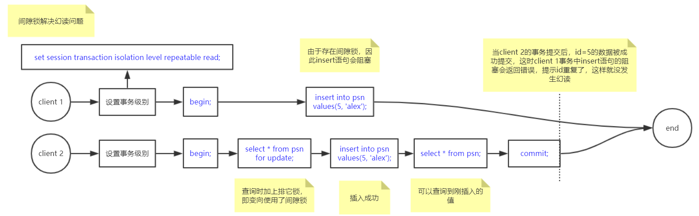

```sql
set session transaction isolation level repeatable read;

begin;
select * from psn for update;
insert into psn values(5, 'alex');
select * from psn;
commit;
```

## 索引

​	索引是为了加快对数据的搜索速度而设立的。索引是方案（schema）中的一个数据库对象，与表独立存放。

​	索引的作用：在数据库中用来加速对表的查询，通过使用快速路径访问方法快速定位数据，减少了磁盘的I/O

​	索引创建的两种情况：

1. 自动: 当在表上定义一个 `PRIMARY KEY` 或者 `UNIQUE` 约束条件时，数据库自动创建一个对应的唯一索引
2. 手动: 用户可以创建索引以加速查询

索引要点：

- 索引改善检索操作的性能，但降低数据插入、修改和删除的性能。在执行这些操作时，MySQL 必须动态地更新索引

- 索引数据可能要占用大量的存储空间

- 并非所有的数据都适合于索引。唯一性不好的数据（如省）从索引得到的好处不比具有更多可能值的数据（如姓名）从索引得到的好处多

- 索引用于数据过滤和数据排序。如果经常以某种特定的顺序排序数据，则该数据可能是索引的备选

- 可以在索引中定义多个列（如省加城市），这样的索引只在以省加城市的顺序排序时有用。如果想按城市排序，则这种索引没有用处

- 如果 sql 语句中存在运算，那么索引会无效，因此要避免索引无效的情况

  ```mysql
  mysql> explain select * from it where id=4;
  +----+-------------+-------+------------+-------+---------------+---------+---------+-------+------+----------+-------+
  | id | select_type | table | partitions | type  | possible_keys | key     | key_len | ref   | rows | filtered | Extra |
  +----+-------------+-------+------------+-------+---------------+---------+---------+-------+------+----------+-------+
  |  1 | SIMPLE      | it    | NULL       | const | PRIMARY       | PRIMARY | 4       | const |    1 |   100.00 | NULL  |
  +----+-------------+-------+------------+-------+---------------+---------+---------+-------+------+----------+-------+
  1 row in set (0.08 sec)
  
  mysql> explain select * from it where id + 1 = 4;
  +----+-------------+-------+------------+------+---------------+------+---------+------+------+----------+-------------+
  | id | select_type | table | partitions | type | possible_keys | key  | key_len | ref  | rows | filtered | Extra       |
  +----+-------------+-------+------------+------+---------------+------+---------+------+------+----------+-------------+
  |  1 | SIMPLE      | it    | NULL       | ALL  | NULL          | NULL | NULL    | NULL |    5 |   100.00 | Using where |
  +----+-------------+-------+------------+------+---------------+------+---------+------+------+----------+-------------+
  1 row in set (0.09 sec)
  ```

### 操作

```sql
-- 查询索引
show index from emp;
-- 创建索引的3种方式
create index i_ename on emp(ename);
alter table emp add key(ename);
alter table emp add index [index_name](ename);
-- 删除索引
drop index i_ename on emp;
```

### 分类

​	mysql 索引分为五类：

- 主键索引

  - 主键是一种唯一性索引，但是不能为空
  - 每个表最多只能有一个主键（一个主键不代表一个列）
  - 当表没有主键时，会找唯一键，建立唯一索引
  - 当表没有主键也没有唯一键时，mysql 自动创建一个`rowid`列作为主键并建立主键索引。该列对用户不可见，对系统可见
  - 主键无特殊情况时，建议设置“自动递增”，这样主键索引维护起来成本较低，不存在页分裂、页合并等影响性能的操作

  > 当按照索引顺序插入时，page的填充率能达到15/16 ， 而乱序插入时只能到略大于 1/2 的填充率。
  >
  > 会带来10%的TPS提升，并减少50%的空间浪费。

  

  - 主键的"自动递增"功能，通过"自增锁"实现

- 唯一索引

  - 索引列所有值不能相同，值可以为空

- 普通索引

  - 基本的索引类型，值可以为空
  - 存在回表操作，需要遍历两次 B+ 树
  - <font color='blue'>覆盖索引</font>：**要查询的列被所建的索引覆盖**。建立索引后，如果要查询非主键字段，则需要回表。如果只查询主键值或者索引的值（如 sql 语句是`select id from emp where ename='KING'`），此时直接可以从索引数据中获取，这就称为 "覆盖索引"。在InnoDB中因为覆盖索引少了一次回表，因此效率会提高。

- 全文索引

  - 索引类型为“FULLTEXT”，可在“varchar”、“char”、“text”类型上创建
  - 5.6之前，全文索引只存在与`MyISAM`中；5.6 开始，`Innodb`也开始支持全文索引
  - 比较少用，本身 mysql 做大文本存储就很少用

- 组合索引

  - 多列值组成一个索引，专门用于组合搜索
  - <font color='blue'>最左匹配原则</font>：组合索引会对多个列建立索引，这多个列的顺序是有说法的。如创建一个`name`、`age`顺序的索引。此时存在一个细节点，如果用`name`和`age`组合查询时，这个索引一定能起作用。当只根据`name`查询时，因为匹配索引的最左列`name`，因此这个索引也能起作用。当只根据`age`查询时，不满足最左匹配，因此该索引不起作用

  > 注意：`select * from text where name like '%a'`是不会走name索引的，而`select * from text where name like 'a%'`会走name索引。
  >
  > 
  >
  > 如果有个场景，存在根据`name`的查询、根据`name`和`age`的查询、根据`age`的查询，那么方案就有两种
  >
  > 1：组合索引`name age`，普通索引`age`
  >
  > 2：组合索引`age name`，普通索引`name`
  >
  > 如何选择？从空间考虑
  >
  > 从效率上考虑，两者几乎无差别。从空间上考虑，因为`name`字段长度长，因此方案1 更省空间，1 更优

> <font color='blue'>索引下推</font>，5.7版本开始支持，前提是必须存在组合索引
>
> 假设我们有一个`user`表，建立了`(username, age, sex)`的联合索引。此时有这样一个语句`select * from user where username like 'M%' and sex = 1`，这条语句的执行有 2 种方式：
>
> 1. 根据联合索引，先找到名字符合条件的索引，然后回表获取整行数据，最后根据`sex`进行删选
> 2. 根据联合索引，先找到满足名字条件的索引，然后直接筛选符合`sex`的索引（因为联合索引里有sex的值），最后回表获取整行数据
>
> 显然 2 回表时查询的全行数据较少，效率更高，这就是 mysql 的索引下推。默认索引下推是开启的，可通过`select @@optimizer_switch;`查询是否开启，通过`SET global optimizer_switch = 'index_condition_pushdown=off';`可以关闭索引下推
>
> 注意：如果语句是`select * from user where username like 'M%' and age > 18`，那么直接利用联合索引`(username, age, sex)`和最左匹配原则，直接筛选出了符合`username like 'M%' and age > 18`的数据

### 索引维护

​	索引在插入新的值的时候，为了维护索引的有序性，必须要维护， 在维护索引的时候需要需要分以下集中情况：

- 如果插入一个比较大的值，直接插入即可，几乎没有成本
- 如果插入的是中间的某一个值，需要逻辑上移动后续的元素，空出位置
- 如果需要插入的数据页满了，就需要单独申请一个新的数据页，然后移动部分数据过去，叫做页分裂，此时性能会受影响，同时空间的使用率也会降低，除了页分裂之外还包含页合并

​	因此，尽量使用**自增主键**作为索引


### 基础知识

#### 局部性原理

​	程序和数据的访问都由聚集成群的倾向，在一段时间内，仅使用其中一小部分（称为空间局部性），或者最近访问过的程序代码和数据，很快又被访问的可能性很大（称为空间局部性）

#### 磁盘预读

​	页是存储器的逻辑块，OS 往往将主存和存储区分割为连续的大小相等的块，每个存储块称为一页（也叫page，通常为 4k），主存和磁盘以页为单位交换数据

​	预读长度一般为页的整数倍

#### 提升I/O的优化方向

1. 降低 I/O 发生次数
2. 降低每次 I/O 读取的数据量


### 面试题

​	mysql 索引是面试高频问题，因此直接通过面试题，来深度解析索引

#### 1. 索引存储在哪里？

​	要想知道索引存在哪里，就必须知道存储引擎是什么。存储引擎存储了 mysql 的所有数据（包括索引、表结构、表数据），不同的存储引擎会有不同的文件格式，不同的存放位置，因此按照存方式可将索引分为两类：

- 聚簇索引：数据和索引放在一个文件里（innodb）

  - `.frm`存放表结构
  - `.ibd`存放数据和索引

  > `innodb`存储引擎有一个系统参数可配置`innodb_file_per_table`，当开启后`set GLOBAL innodb_file_per_table=on;`，也就是启用`InnoDB`的独立表空间模式，此时才会为每个单独的表创建一份`.ibd`数据文件。如果不开启，则将数据文件放到系统表空间里，即`${date-dir}/ibdata1`文件

- 非聚簇索引：数据和索引放在不同文件（MyISAM）

  - `.frm`存放表结构
  - `.MYI`存放索引数据
  - `.MYD`存放实际数据

> 从 8.0 开始，`.frm`文件已经被移除了，表结构信息放在了元数据表`information_schema`中

​	**总结**：存储引擎是`innodb`和`MyISAM`时，索引存在磁盘上；存储引擎是`memory`时，索引存在内存中


#### 2. mysql 索引底层使用的数据结构是什么？为什么不用哈希表、二叉树、AVL树、红黑树、B树？

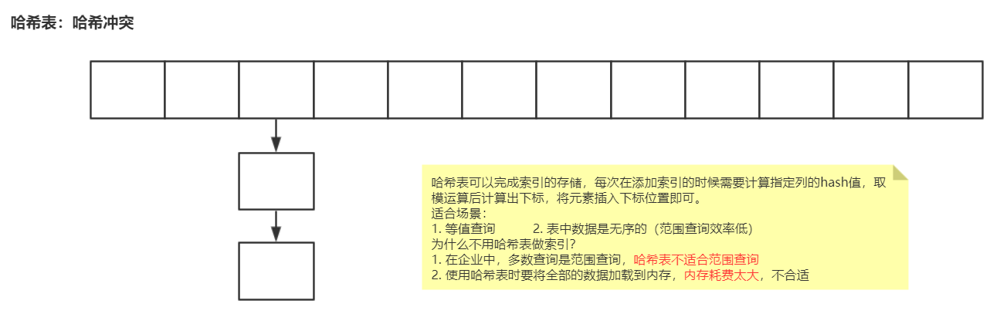

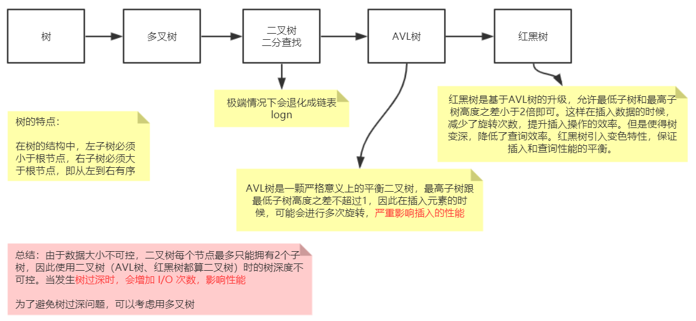

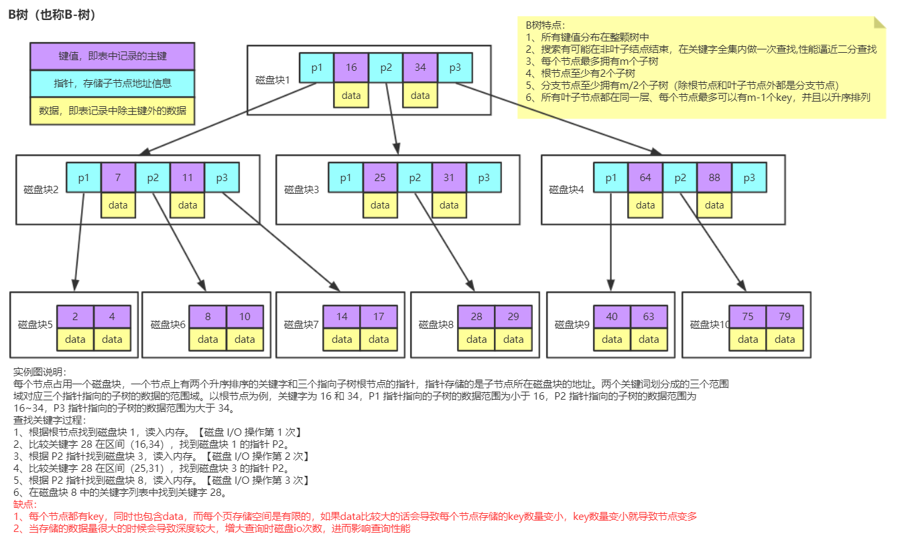

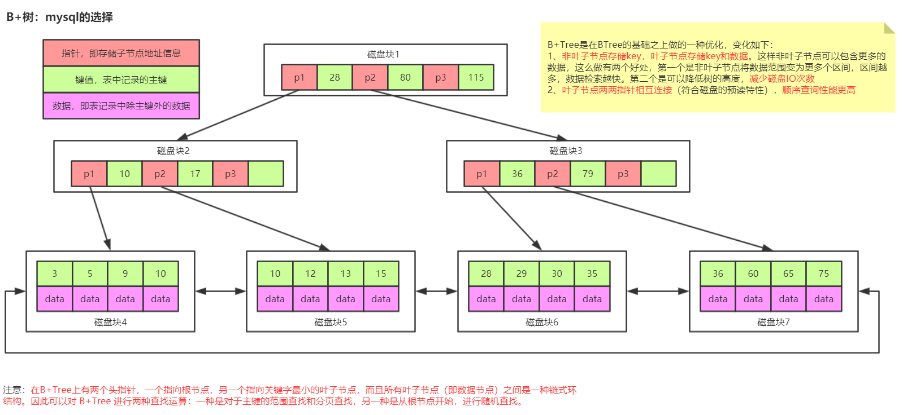

> B-tree和B+tree的最大区别是，B+tree叶子节点间存在双向指针。这是MySQL官方文档里说的

​	不同的存储引擎，B+树的实现略有不同。在`InnoDB`中，一个磁盘块默认大小是16k，由于数据和索引在一个文件里，因此叶子节点直接存放了整条数据。在`MyISAM`中，因为数据和索引不在一个文件里，因此叶子节点存放的是地信息址，地址指向了数据所在位置。

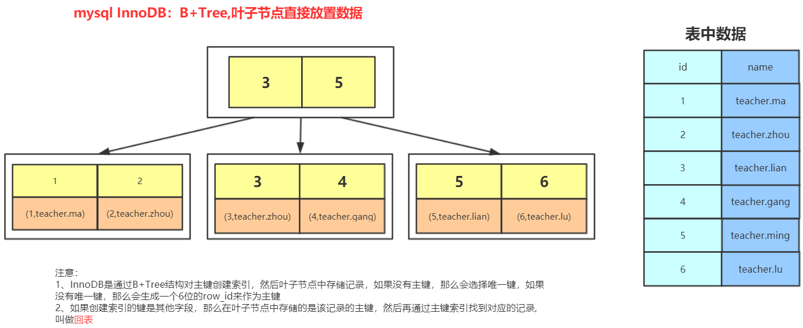

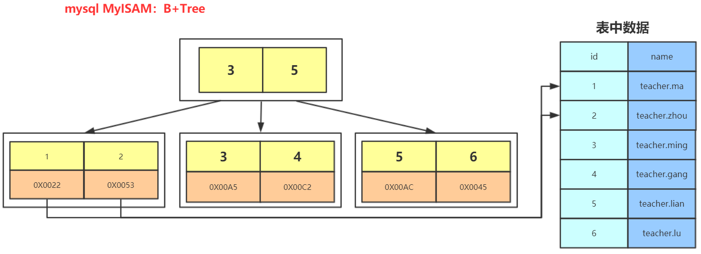

> <font color='blue'>回表</font>：默认的当我们创建了一个主键或者唯一键时，mysql 会自动为该列创建索引。如果我们手动的给列 A 创建了索引，A 列索引也会以B+树进行文件存储，此时叶子节点存储的不是整行数据，而是该行数据的主键。当根据 A 列查找数据时，会先根据 A 列的索引找到对应行的主键，然后去主键索引结构里找到整行数据，这个过程叫做"回表"。回表只会出现在`innodb`中，为了节省空间。而在MyISAM中叶子节点直接存储了行数据的地址，根本不存在为了节省空间而存储索引后进行回表操作。

