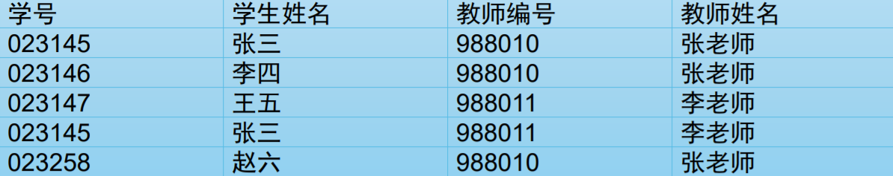
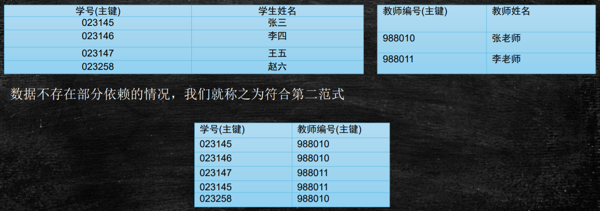

# 1.数据库设计三范式

## 是什么

### 第一范式

​	定义：所有字段值都是不可分解的原子值，即**所有列不可再分割**

​	举个例子，比如数据库表中有一列是"地址"，如果地址列存储了这样的值："北京市海淀区xx镇xx小区xx号"，这样的值不满足第一范式，因为地址字段值可以再分割为省、市、区等。那么如果有10w个住在海淀区的人，那么地址字段里就存了10w个"海淀区"字眼，存在数据冗余

### 第二范式

​	定义：确保**表中的每列都和主键相关**。也就是说在一个数据库表中，一 个表中只能保存一种数据，不可以把多种数据保存在同一张数据库表中

​	示例：

​	如果一张表设计成下图所示

​	这张表设计是不符合第二范式的

- 存在多对多关系时只有一个字段作为主键是不够的
- 这张表中的主键是学号和教师编号的组合
- 部分依赖，会产生冗余数据，需要分解表

​	需要改成如下设计，即满足了第二范式

### 第三范式

​	定义：要求一个**数据库表中不包含已在其它表中包含的非主关键字信息**

> 三范式是一个递进的过程，满足前者后才有满足后者的可能；满足后者就必然满足前者

## 三范式目的

​	三范式为了**减少数据冗余**（面试可能会问）