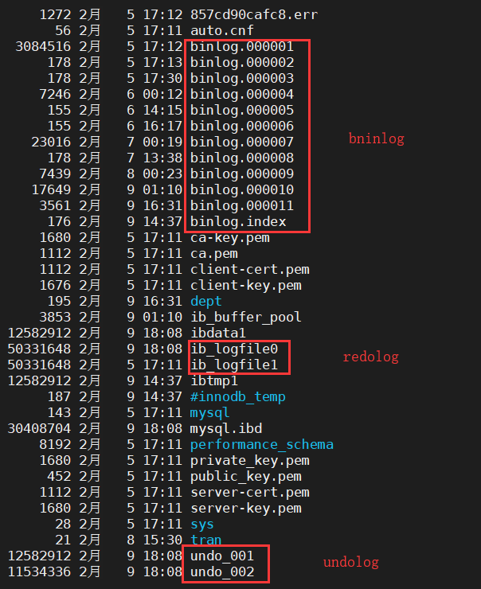
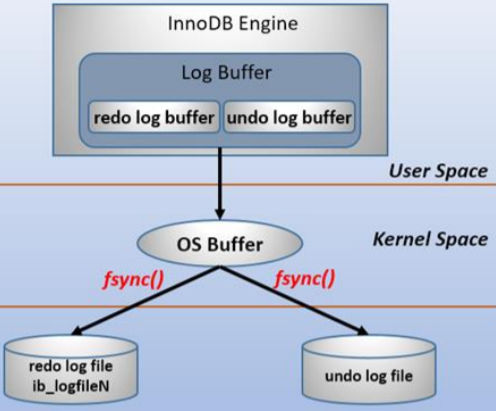
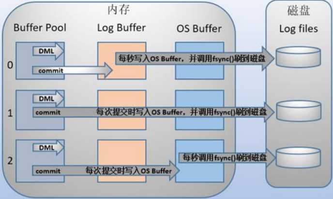
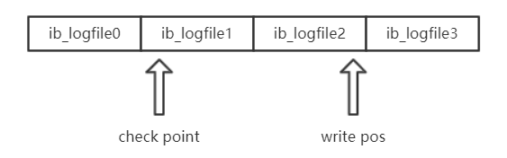
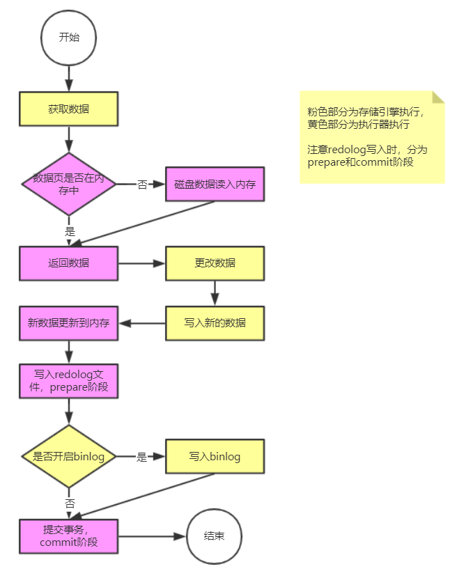
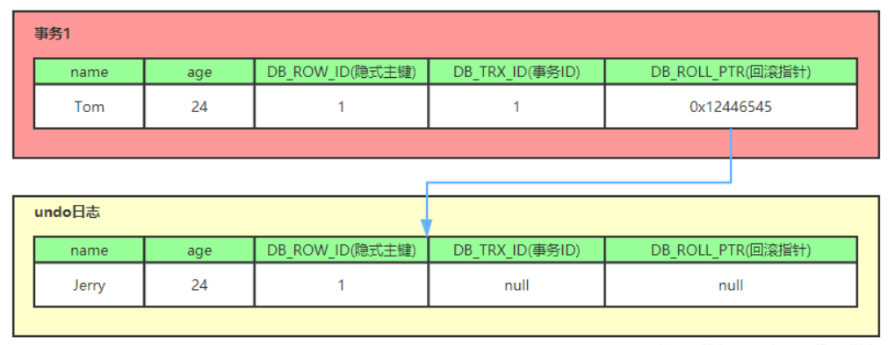
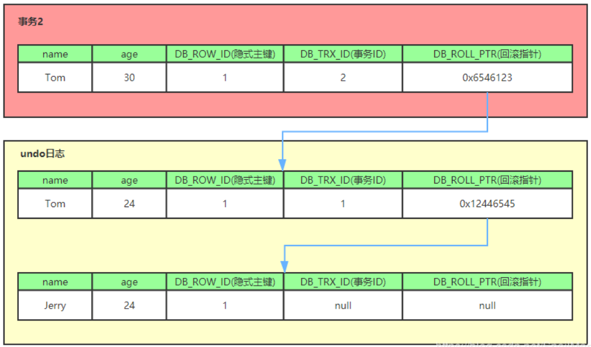
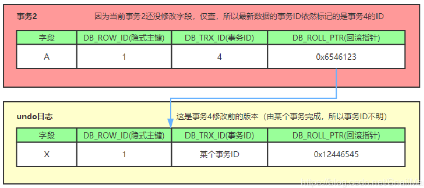

# 1.日志及MVCC

​	MySQL中的日志有三类，`binlog`、`redolog`和`undolog`。其中`binlog`是服务端的日志文件，`redolog`和`undolog`是存储引擎层的日志文件，且只在存储引擎是`innodb`时才存在

## binlog

​	`binlog`称为二进制日志，是服务端的日志，它存储了 mysql 中的所有数据，主要有 2 个作用：

- 通过`binlog`进行数据恢复
- mysql 主从复制时，从节点通过`binlog`同步主节点数据

​	`binlog`是**逻辑日志**，记录了每个语句的原始逻辑，并且采用追加写的方式写入日志文件，即顺序写入

​	一般在企业中数据库会有备份系统，可以定期执行备份，备份的周期可以自己设置。通过`binlog`恢复数据的过程如下：

1. 找到最近一次的全量备份数据
2. 从备份的时间点开始，将备份的`binlog`取出来，重放到要恢复的那个时刻

> 在 8.0 版本，`binlog`默认是开启的。可通过`select @@log_bin;`查看当前配置

## redolog

​	`redolog`可以**提高更新效率**。如果每次发生数据更新就写入磁盘触发IO，性能损耗严重。为了优化这一点，`redolog`用到的`WAL`技术，`WAL`的全称是`Write-Ahead Logging`，它的关键点是先写日志再写磁盘，并且写日志是顺序写入内存速度很快。`redolog`在用户空间中存在一个`redo log buffer`，当发生数据修改时，`innodb`引擎会先将记录写到`redo log buffer`中， 并更新内存，此时更新就算是完成了，同时`innodb`引擎会在合适的时机将`redo log buffer`写入到磁盘中。

​	关于何时将`redo log buffer`内容写到磁盘，可通过`innodb_flush_log_at_trx_commit;`来配置，该参数值可以为 0或1或2，具体含义看下图：

- 0：`redulog`在`commit`阶段，会将数据写到`redo log buffer`里，不同步执行刷到磁盘操作。然后 MySQL 会每秒执行一次`redo log buffer`的`fsync`操作将数据刷到磁盘。该模式下，当发生掉电时最多会丢失 1 秒内的全部操作。**速度最快，安全性最差**
- 1：每次事务提交时都会把数据刷到磁盘上，这是 8.0 版本的默认值。该模式是**最安全但速度最慢**
- 2：每次事务提交时都会把数据写入到`os buffer`中，不同步执行刷到磁盘操作。然后 MySQL 会每秒执行一次`os buffer`的`fsync`操作。该模式速度较快，比 0 安全，如果有掉电保护组件的话，可以开启

​	`redolog`文件大小是固定的，是一个**物理日志**（记录的是在某个数据页上做了什么样的修改），使用的是循环写入的过程。

​	如下图所示，在`redolog`中存在两个指针，`write pos`代表下次数据写入的位置，可以一直往后写满`ib_logfile3`和`ib_logfile0`，最多写数据到`check point`位置。而`check point`到`write pos`之间则代表当前存在的数据

### 数据更新流程

​	当出现`redolog`之后，数据的更新流程发生了改变

> 两阶段提交（2PC）
>
> 为什么 `redolog`要分为两阶段？
>
> 为了保证`redolog`和`binlog`的数据一致性。当恢复数据时，无论根据`redolog`还是`binlog`，得到的数据是一致的。
>
> 通过`select @@log_bin;`可以查看是否开启`binlog`。如果没有开启，就不存在`binlog`，也没有两个日志文件数据据同步的说法了。
>
> 在 8.0 之前，可以通过参数`innodb_support_xa`配置决定是否开启两阶段提交，值为1时代表开启。而在 8.0 之后，始终启用两阶段提交

​	有了`redolog`之后，还有个好处。mysql 可以保证即使数据库发生异常重启，根据`binlog`及`redolog`中记录的每个事务的状态，实现已提交的事务数据不丢失、未提交的事务数据进行回滚，这叫做 crash-safe，**保证了事务的持久性特点**

> 为了实现毫无差错的`crash-safe`，在写入`redolog`和`binlog`文件时必须进行一次`fync`操作将日志刷入磁盘，这样才能保证掉电时两个日志数据都写入了磁盘并且数据一致。因此`redolog`必需设置`innodb_flush_log_at_trx_commit=1`。`binlog`也有决定何时进行`fync`的配置`sync_binlog`，当值为0时代表刷新binlog_cache中的信息到磁盘由os决定。当值大于0为N时，代表每N次事务提交后就刷新`binlog cache`中的信息到磁盘。因此还要设置`sync_binlog=1`。两个参数值都得为1，俗称"双1"，是保证`crash-safe`的根本，官方也建议在需要保证事务持久性和一致性场景下设置成双1。

> 数据恢复逻辑：
>
> 情况一：开启`binlog`
>
> binlog有记录，redolog状态commit：正常完成的事务，无需操作
> binlog有记录，redolog状态prepare：在binlog写完提交事务之后的crash，提交事务
> binlog无记录，redolog状态prepare：在binlog写完之前的crash，回滚事务
> binlog无记录，redolog无记录：在redolog prepare之前crash，回滚事务
>
> 情况二：未开启`binlog`
>
> redolog状态是commit，正常完成的事务，无需操作
>
> redolog状态是prepare，回滚事务

## undolog

​	**`undolog`可以保证事务的原子性**特点，还可以实现多版本并发控制（简称MVCC）。在操作任何数据之前，首先将数据备份到`undolog`中，然后进行数据的修改。如果出现了错误或者用户执行了`ROLLBACK`语句，系统可以利用`undolog`中的备份将数据恢复到事务开始之前的状态。

​	`undolog`是一个**逻辑日志**，可以这么理解：

- 当`delete`一条记录时，`undolog`中会记录一条对应的`insert`记录
- 当`insert`一条记录时，`undolog`中会记录一条对应的`delete`记录
- 当`update`一条记录时，它记录一条对应相反的`update`记录

​	当需要回滚时，执行`undolog`即可恢复到事务最开始的状态

## MVCC

### 是什么	

​	多版本并发控制MVCC：是一种并发控制的方法，一般在数据库管理系统中，实现对数据库的并发访问，在编程语言中实现事务内存。

​	先了解两个概念：

- 当前读

  ​	像select lock in share mode(共享锁)，select for update ; update， insert ，delete(排它锁)这些操作都是一种当前读，为什么叫当前读？就是它**读取的是记录的最新版本，读取时还要保证其他并发事务不能修改当前记录，会对读取的记录进行加锁**

- 快照读

  ​	像不加锁的select操作就是快照读，即**不加锁的非阻塞读**；快照读的前提是隔离级别不是串行级别，串行级别下的快照读会退化成当前读；之所以出现快照读的情况，是基于提高并发性能的考虑，快照读的实现是基于多版本并发控制，即MVCC，可以认为MVCC是行锁的一个变种，但它在很多情况下，避免了加锁操作，降低了开销；既然是基于多版本，即快照读可能读到的并不一定是数据的最新版本，而有可能是之前的历史版本

​	简单的说，**MVCC就是为了实现读-写冲突不加锁**，而这个读指的就是快照读，而非当前读，当前读实际上是一种加锁的操作，是悲观锁的实现

### 实现原理

​	MVCC的实现原理主要是依赖这三个东西：**隐式字段，undo日志，Read View**

#### 隐式字段

​	每行记录除了我们自定义的字段外，还有数据库隐式定义的`DB_TRX_ID`，`DB_ROLL_PTR`，`DB_ROW_ID`等字段。

- `DB_TRX_ID`：6byte，最近修改(修改/插入)事务ID：记录 创建这条记录/最后一次修改该记录 的事务ID
- `DB_ROLL_PTR`：7byte，回滚指针，指向这条记录的上一个版本（存储于rollback segment里），配合undolog使用
- `DB_ROW_ID`：6byte，隐含的自增ID（隐藏主键），如果数据表没有主键，InnoDB会自动以DB_ROW_ID产生一个聚簇索引
- 实际还有一个 删除flag 隐藏字段。当记录被更新或删除并不代表真的删除，而是删除flag变了

#### undo log

​	`undo log`主要分为两种：

- `insert undo log`：代表事务在insert新记录时产生的undo log，只在事务回滚时需要，并且在事务提交后可以被立即丢弃
- `update undo log`：事务在进行update或delete时产生的undo log；不仅在事务回滚时需要，在快照读时也需要；所以不能随便删除，只有在快速读或事务回滚不涉及该日志时，对应的日志才会被 purge线程 统一清除

> purge线程：
>
> - 为了实现InnoDB的MVCC机制，更新或者删除操作都只是设置一下老记录的deleted_bit，并不真正将过时的记录删除
>
> - 为了节省磁盘空间，InnoDB有专门的purge线程来清理deleted_bit为true的记录。为了不影响MVCC的正常工作，purge线程自己也维护了一个read view（这个read view相当于系统中最老活跃事务的read view）；如果某个记录的deleted_bit为true，并且DB_TRX_ID相对于purge线程的read view可见，那么这条记录一定是可以被安全清除的。

​	对MVCC有帮助的实质是`update undo log` ，`undo log`实际上就是存在`rollback segment`中旧记录链。

​	以一个示例说明执行流程：

1、有个事务向persion表插入了一条新记录，记录如下，隐式主键是1，事务ID和回滚指针假设为NULL

2、现在来了事务1对该记录name字段进行了修改，改成了Tom

- 在事务1修改该行(记录)数据时，数据库会先对该行加排它锁
- 然后把该行数据拷贝到undo log中，作为旧记录。此时在undo log中有当前行的拷贝副本
- 拷贝完毕后，修改该行name为Tom，并且修改隐藏字段的事务ID为当前事务1的ID。我们默认从1开始，之后递增，回滚指针指向拷贝到undo log的副本记录，既表示我的上一个版本就是它
- 事务提交后，释放锁

3、又来了事务2，修改了该条纪录，age变成了30

- 在事务2修改该行数据时，数据库也先为该行加锁
- 然后把该行数据拷贝到undo log中，作为旧记录，发现该行记录已经有undo log了，那么最新的旧数据作为链表的表头，插在该行记录的undo log最前面
- 修改该行age为30岁，并且修改隐藏字段的事务ID为当前事务2的ID，那就是2，回滚指针指向刚刚拷贝到undo log的副本记录
- 事务提交，释放锁

​	从上面可以看出，不同事务或者相同事务对同一记录的修改，会导致该记录的undo log成为一条记录版本链表，undo log的链首就是最新的旧记录，链尾就是最早的旧记录（当然像之前说的该undo log的节点可能会被purge线程清除掉，像图中的第一条insert undo log，其实在事务提交之后可能就被删除丢失了，不过这里为了演示，所以还放在这里）

#### Read View

​	什么是Read View，说白了Read View就是事务进行快照读操作时生产的读视图(Read View)，在该事务执行的快照读的那一刻，会生成数据库系统当前的一个快照，记录并维护系统当前活跃事务的ID（当每个事务开启时，都会被分配一个ID，这个ID是递增的，所以最新的事务，ID值越大）

​	Read View主要是用来做可见性判断的，即当某个事务执行快照读的时候，对该记录创建一个Read View读视图，把它比作条件用来判断当前事务能够看到哪个版本的数据，既可能是当前最新的数据，也有可能是该行记录的undo log里面的某个版本的数据。

##### Read View如何保证安全性？

​	Read View视图需要确保处于这样一个状态：当前视图里的数据是一部分或者全部事务提交后的结果，不存在未提交事务（即当前活跃事务）的部分数据。如何做到？

​	Read View遵循一个可见性算法，主要是将要被修改的数据的最新记录中的DB_TRX_ID（即当前事务ID）取出来，与系统当前其他活跃事务的ID去对比（由Read View维护），如果DB_TRX_ID跟Read View的属性做了某些比较，不符合可见性，那就通过DB_ROLL_PTR回滚指针去取出Undo Log中的DB_TRX_ID再比较，即遍历链表的DB_TRX_ID（从链首到链尾，即从最近的一次修改查起），直到找到满足特定条件的DB_TRX_ID, 那么这个DB_TRX_ID所在的旧记录就是当前事务能看见的最新老版本

​	如何判断DB_TRX_ID对Read View是否符合可见性？简化一下Read View结构，假设有这三个全局属性

- trx_list：一个数值列表，用来维护Read View生成时刻系统正活跃的事务ID
- up_limit_id：记录trx_list列表中事务ID最小的ID
- low_limit_id：ReadView生成时刻系统尚未分配的下一个事务ID，也就是目前已出现过的事务ID的最大值+1

​	判断逻辑如下：

1. 比较DB_TRX_ID < up_limit_id，如果小于，则代表当前View能看到DB_TRX_ID所在的记录，符合可见性。否则进入下个判断
2. 判断 DB_TRX_ID 大于等于 low_limit_id，如果大于等于则代表DB_TRX_ID所在的记录在Read View生成后才出现的，那对当前View肯定不可见，如果小于则进入下一个判断
3. 判断DB_TRX_ID 是否在活跃事务之中，trx_list.contains(DB_TRX_ID)，如果在，则代表View生成时刻，这个事务还在活跃，还没有Commit，你修改的数据，我当前View也是看不见的，不符合可见性；如果不在，则说明这个事务在View生成之前就已经Commit了，你修改的结果，我当前事务是能看见的，即符合可见性

#### 整体流程

​	有了上面三个概念后，回到MVCC，看看MVCC实现的整体流程。

- 当`事务2`对某行数据执行了`快照读`，数据库为该行数据生成一个`Read View`读视图，假设当前事务ID为`2`，此时还有`事务1`和`事务3`在活跃中，`事务4`在`事务2`快照读前一刻提交更新了，所以Read View记录了系统当前活跃事务1，3的ID，维护在一个列表上，假设称为`trx_list`

  | 事务1    | 事务2    | 事务3    | 事务4        |
  | -------- | -------- | -------- | ------------ |
  | 事务开始 | 事务开始 | 事务开始 | 事务开始     |
  |          |          |          | 修改且已提交 |
  | 进行中   | 快照读   | 进行中   |              |
  |          |          |          |              |

- Read View不仅仅会通过一个列表trx_list来维护事务2执行快照读那刻系统正活跃的事务ID，还会有两个属性up_limit_id（记录trx_list列表中事务ID最小的ID），low_limit_id(记录快照读那刻系统尚未分配的下一个事务ID)。在例子中up_limit_id就是1，low_limit_id就是4 + 1 = 5，trx_list集合的值是1，3，Read View如下表

| 属性         | 值   |
| ------------ | ---- |
| trx_list     | 1，3 |
| up_limit_id  | 1    |
| low_limit_id | 5    |

- 在产生视图时只有事务4修改过该行记录，并在事务2执行快照读前，就提交了事务，所以当前该行数据的undo log如下图所示；我们的事务2在快照读该行记录时候，会拿该行记录的DB_TRX_ID去跟up_limit_id,low_limit_id和trx_list进行比较，判断当前事务2能看到该记录的版本是哪个

  

- 先拿该记录DB_TRX_ID字段记录的事务ID 4去跟Read View的的up_limit_id比较，看4是否小于up_limit_id(1)，所以不符合条件，继续判断 4 是否大于等于 low_limit_id(5)，也不符合条件，最后判断4是否处于trx_list中的活跃事务，发现事务ID为4的事务不在当前活跃事务列表中，符合可见性条件，所以事务4修改后提交的最新结果对事务2快照读时是可见的，所以事务2能读到的最新数据记录是事务4所提交的版本，而事务4提交的版本也是全局角度上的最新版本

- 也正是Read View生成时机的不同，从而造成RC，RR级别下快照读的结果的不同

**总结**：比较当前数据的tid与view里现存活跃事务list进行比较，然后根据大小、是否存在等关系来判断数据是否对当前view可见，可见则直接读该数据，不可见就回滚一次（通过`undo log`实现回滚），重新判断可见性，直到找一个可见的版本

### MVCC相关问题

#### RR是如何在RC级的基础上解决不可重复读的？

- 在RR级别下的某个事务对某条记录的第一次读会创建一个快照及Read View，将当前系统活跃的其他事务记录起来，此后在调用快照读的时候，还是使用的是同一个Read View，所以只要当前事务在其他事务提交更新之前使用过快照读，那么之后的快照读使用的都是同一个Read View，所以对之后的修改不可见；
- 即RR级别下，快照读生成Read View时，Read View会记录此时所有其他活动事务的快照，这些事务的修改对于当前事务都是不可见的。而早于Read View创建的事务所做的修改均是可见
- 而在RC级别下的事务中，每次快照读都会新生成一个快照和Read View，这就是在RC级别下的事务中可以看到别的事务提交的更新的原因

​	总结，在RC隔离级别下，每个快照读都会生成最新的Read View；在RR下，同一个事务中只会在第一次快照读时创建Read View，并且之后的快照读也是读的先前的Read VIew。

### 总结

- **MVCC作用是不加锁的方式解决快照读与写冲突问题**
- **MVCC是一种乐观锁体现**
- **当发生快照读时（注意快照读本身就在一个事务里），通过MVCC会组装一个view，这个view只包含当前事务发生之前已提交的最新数据，和当前事务在快照读前修改的最新数据，而不存在其他未提交事务的脏数据或者老的数据，或者在当前事务之后新创建事务提交的数据**
- **快照读只会在select不加锁时存在**
- **RR级别下，同一事务里的只会生成一个快照读**
- **RC级别下，每次快照读都生成新的view，因此存在不可重复读问题**

参考[MVCC](https://blog.csdn.net/SnailMann/article/details/94724197)