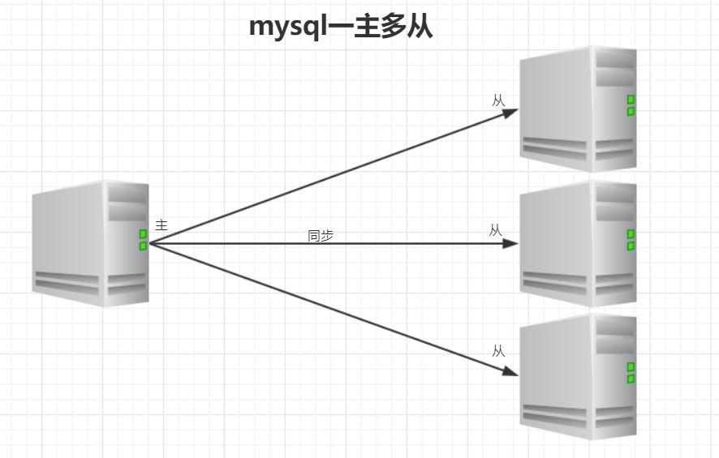
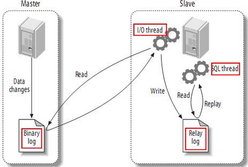

# 3.主从复制

## 理论基础

### 为什么需要主从复制？

1、在业务复杂的系统中，有这么一个情景，有一句sql语句需要锁表，导致暂时不能使用读的服务，那么就很影响运行中的业务，使用主从复制，让主库负责写，从库负责读，这样，即使主库出现了锁表的情景，通过读从库也可以保证业务的正常运作

2、做数据的热备

3、架构的扩展。业务量越来越大，I/O访问频率过高，单机无法满足，此时做多库的存储，降低磁盘I/O访问的频率，提高单个机器的I/O性能

### mysql的主从复制

#### 是什么

​	MySQL 主从复制是指数据可以从一个MySQL数据库服务器主节点复制到一个或多个从节点。MySQL 默认采用异步复制方式，这样从节点不用一直访问主服务器来更新自己的数据，数据的更新可以在远程连接上进行，从节点可以复制主数据库中的所有数据库或者特定的数据库，或者特定的表。

#### mysql主从形式

##### 一主一从


##### 主主复制


##### 一主多从



##### 多主一从


##### 联级复制


#### 原理

1. master服务器将数据的改变记录二进制binlog日志，当master上的数据发生改变时，则将其改变写入二进制日志中；		

2. slave服务器会在一定时间间隔内对master二进制日志进行探测其是否发生改变，如果发生改变，则开始一个I/OThread请求master二进制事件

3. 同时主节点为每个I/O线程启动一个dump线程，用于向其发送二进制事件，并保存至从节点本地的中继日志中，从节点将启动SQL线程从中继日志中读取二进制日志，在本地重放，使得其数据和主节点的保持一致，最后I/OThread和SQLThread将进入睡眠状态，等待下一次被唤醒。

也就是说

- 从库会生成两个线程,一个I/O线程,一个SQL线程;
- I/O线程会去请求主库的binlog,并将得到的binlog写到本地的relay-log(中继日志)文件中;
- 主库会生成一个log dump线程,用来给从库I/O线程传binlog;
- SQL线程,会读取relay log文件中的日志,并解析成sql语句逐一执行;

#### 注意点

1. master将操作语句记录到binlog日志中，然后授予slave远程连接的权限（master一定要开启binlog二进制日志功能；通常为了数据安全考虑，slave也开启binlog功能）。
2. slave开启两个线程：IO线程和SQL线程。其中：IO线程负责读取master的binlog内容到中继日志relay log里；SQL线程负责从relay log日志里读出binlog内容，并更新到slave的数据库里，这样就能保证slave数据和master数据保持一致了。
3. Mysql复制至少需要两个Mysql的服务，当然Mysql服务可以分布在不同的服务器上，也可以在一台服务器上启动多个服务。
4. Mysql复制最好确保master和slave服务器上的Mysql版本相同（如果不能满足版本一致，那么要保证master主节点的版本低于slave从节点的版本）
5. master和slave两节点间时间需同步



#### 具体步骤

1、从库通过手工执行change  master to 语句连接主库，提供了连接的用户一切条件（user 、password、port、ip），并且让从库知道，二进制日志的起点位置（file名 position 号），然后手工执行`start  slave`开启从节点模式；

2、从库的IO线程和主库的dump线程建立连接；

3、从库根据change  master  to语句提供的file名和position号，IO线程向主库发起binlog的请求；

4、主库dump线程根据从库的请求，将本地binlog以events的方式发给从库IO线程；

5、从库IO线程接收binlog  events，并存放到本地relay-log中，传送过来的信息会记录到master.info中；

6、从库SQL线程利用relay-log文件进行数据同步，默认情况下，已经同步过的relay会自动被 purge线程 清理。


#### 主从同步延时分析

​		mysql的主从复制都是单线程的操作，主库对所有DDL和DML产生的日志写进binlog，由于binlog是顺序写，所以效率很高，slave的sql thread线程将主库的DDL和DML操作事件在slave中重放。DML和DDL的IO操作是随机的，不是顺序，所以成本要高很多，另一方面，由于sql thread也是单线程的，当主库的并发较高时，产生的DML数量超过slave的SQL thread所能处理的速度，或者当slave中有大型query语句产生了锁等待，那么延时就产生了。

##### 5.7之前的解决方案

1. 业务的持久化层的实现采用分库架构，mysql服务可平行扩展，分散压力。
2. 单个库读写分离，一主多从，主写从读，分散压力。这样从库压力比主库高，保护主库。
3. 服务的基础架构在业务和mysql之间加入memcache或者redis的cache层。降低mysql的读压力。
4. 不同业务的mysql物理上放在不同机器，分散压力。
5. 使用比主库更好的硬件设备作为slave，mysql压力小，延迟自然会变小。
6. 使用更加强劲的硬件设备


##### MTS：5.7开始的终极解决方案

​	MySQL的复制延迟是一直被诟病的问题之一，在MySQL 5.7版本已经支持“真正”的并行复制功能，官方称为为“enhanced multi-threaded slave”（简称MTS），因此复制延迟问题已经得到了极大的改进。总之，MySQL 5.7版本后，复制延迟问题永不存在。

​	在MySQL 5.7版本之前，Slave服务器上有两个线程I/O线程和SQL线程。I/O线程负责接收二进制日志（更准确的说是二进制日志的event），SQL线程进行回放二进制日志。如果在MySQL 5.7版本开启并行复制功能，那么SQL线程就变为了coordinator（协调者）线程，coordinator线程会和worker线程（进行回放的线程）通讯，两者是生产者消费者模型。

​	并发复制的核心是**组复制**（group commit）：通过对事务进行分组，优化减少了生成二进制日志所需的操作数。当事务同时提交时，它们将在单个操作中写入到二进制日志中。如果事务能同时提交成功，那么它们就不会共享任何锁，这意味着它们没有冲突，因此可以在Slave上并行执行。所以通过在主机上的二进制日志中添加组提交信息，这些Slave可以并行地安全地运行事务。

​	MySQL 5.7并行复制的思想一言以蔽之：**一个组提交（group commit）的事务都是可以并行回放的，因为这些事务都已进入到事务的prepare阶段，则说明事务之间没有任何冲突（否则就不可能提交）**。

###### 相关参数配置

1、配置并行复制的级别

​	`slave-parallel-type`配置支持以下两个值：

- `DATABASE`：默认值，基于库的并行复制方式
- `LOGICAL_CLOCK`：基于组提交的并行复制方式

2、配置worker线程个数

​	`slave_parallel_workers`用来配置worker线程个数。默认是0，代表mysql退化为之前的单线程复制。如果是1，则SQL线程转换成coordinator线程，但是只有1个worker线程进行回放，也是单线程复制。但是额外多了一次coordinator线程的转发，因此slave_parallel_workers=1的性能反而比0还要差。

3、如何保证事务按照纪录顺序回放

​	MySQL 5.7后的MTS可以实现更小粒度的并行复制，但需要将`slave_parallel_type`设置为LOGICAL_CLOCK，但仅仅设置为LOGICAL_CLOCK也会存在问题，因为此时在slave上应用事务的顺序是无序的，和relay log中记录的事务顺序不一样，这样数据一致性是无法保证的，为了保证事务是按照relay log中记录的顺序来回放，就需要开启参数`slave_preserve_commit_order`。开启该参数后，执行线程将一直等待，直到提交之前所有的事务。当从线程正在等待其他工作线程提交其事务时，它报告其状态为等待前面的事务提交。所以虽然MySQL 5.7添加MTS后，虽然slave可以并行应用relay log，但commit部分仍然是顺序提交，其中可能会有等待的情况。

​	当开启`slave_preserve_commit_order`参数后，`slave_parallel_type`只能是LOGICAL_CLOCK，如果你有使用级联复制，那LOGICAL_CLOCK可能会使离master越远的slave并行性越差。

​	但是经过测试，这个参数在MySQL 5.7.18中设置之后，也无法保证slave上事务提交的顺序与relay log一致。 在MySQL 5.7.19设置后，slave上事务的提交顺序与relay log中一致（所以生产要想使用MTS特性，版本大于等于MySQL 5.7.19才是安全的）。

​	**总结**：要开启MTS，建议设置如下配置：

```mysql
slave-parallel-type=LOGICAL_CLOCK #使用逻辑时钟，基于组提交实现并行复制，默认是DATABASE
slave-parallel-workers=16 #设置并行线程数，通常和CPU核数一致
slave_pending_jobs_size_max = 2147483648
slave_preserve_commit_order=1
master_info_repository=TABLE # 开启MTS后会频繁更新master.info文件，设置为TABLE减少开销
relay_log_info_repository=TABLE
relay_log_recovery=ON # 如果从库IO线程崩溃，并且relaylog损坏，则放弃所有未执行的relaylog，重新从master获取日志保持完整
```


## 一主一从试验

1、基础设置准备

```shell
#mysql版本：
8.0.18
#一台虚拟机启两个mysql容器，实际环境要用2台机器跑2个mysql，以增强服务能力
主：192.168.44.134:3306
从：168.44.134:3307
```

2、运行2个mysql容器

```shell
# 创建挂载目录和配置文件
mkdir -p /opt/mysql-img-data/data1 && touch /opt/mysql-img-data/my.cnf1
mkdir -p /opt/mysql-img-data/data2

vi /opt/mysql-img-data/my.cnf1
# mysql配置文件内容如下
[mysqld]
pid-file        = /var/run/mysqld/mysqld.pid
socket          = /var/run/mysqld/mysqld.sock
datadir         = /var/lib/mysql
secure-file-priv= NULL
# Disabling symbolic-links is recommended to prevent assorted security risks
symbolic-links=0

# Custom config should go here
!includedir /etc/mysql/conf.d/

# ------------------------
cp /opt/mysql-img-data/my.cnf1 /opt/mysql-img-data/my.cnf2

# 创建2个mysql容器
docker run -itd --name mysql1 -p 3306:3306 -v /opt/mysql-img-data/my.cnf1:/etc/mysql/my.cnf -v /opt/mysql-img-data/data1:/var/lib/mysql -e MYSQL_ROOT_PASSWORD=mysql mysql:8.0.18

docker run -itd --name mysql2 -p 3307:3306 -v /opt/mysql-img-data/my.cnf2:/etc/mysql/my.cnf -v /opt/mysql-img-data/data2:/var/lib/mysql -e MYSQL_ROOT_PASSWORD=mysql mysql:8.0.18
```

3、在两台数据库中分别创建数据库

```sql
--注意两台必须全部执行
create database test;
```

4、调整主服务器配置

```shell
#修改配置文件，执行以下命令打开mysql配置文件
vi /opt/mysql-img-data/my.cnf1
#在mysqld模块中添加如下配置信息
log-bin=master-bin #二进制文件名称
binlog-format=ROW  #二进制日志格式，有row、statement、mixed三种格式，row指的是把改变的内容复制过去，而不是把命令在从服务器上执行一遍，statement指的是在主服务器上执行的SQL语句，在从服务器上执行同样的语句。MySQL默认采用基于语句的复制，效率比较高。mixed指的是默认采用基于语句的复制，一旦发现基于语句的无法精确的复制时，就会采用基于行的复制。
server-id=1		   #要求各个服务器的id必须不一样
binlog-do-db=test   #同步的数据库名称
```

5、在主服务器上增加从服务器同步数据的权限

```sql
--授权操作
-- 在 mysql 8.0 版本之前，下面三行命令的注释要去掉才起作用
-- set global validate_password_policy=0;
-- set global validate_password_length=1;
grant replication slave on *.* to 'root'@'%' -- identified by '123456';
--刷新权限
flush privileges;
```

6、调整从服务器配置

```shell
#修改配置文件，执行以下命令打开mysql配置文件
vi /etc/my.cnf
#在mysqld模块中添加如下配置信息
log-bin=master-bin	#二进制文件的名称
binlog-format=ROW	#二进制文件的格式
server-id=2			#服务器的id
```

7、重启主服务容器

```shell
#重启mysql服务
docker restart mysql1
#登录mysql数据库
mysql -uroot -p
#查看master的状态，注意Position值
show master status；
```


8、重启从服务容器并开启从节点身份

```shell
#重启mysql服务
docker restart mysql2
#登录mysql
mysql -uroot -p
#连接主服务器，master_log_pos值必须和`show master status`中Position一致
change master to master_host='192.168.44.134',master_user='root',master_password='mysql',master_port=3306,master_log_file='master-bin.000001',master_log_pos=1518;
#启动slave
start slave;
#查看slave的状态，当Slave_IO_Running 和 Slave_SQL_Running都是yes时代表主从搭建完成
show slave status;
```

9、一主一从搭建完成后，进行测试。在主服务器进行相关的数据增删改操作，在从服务器看相关数据更新。

10、`stop slave;`关闭slave节点。可以通过命令关闭相关线程

```sql
stop slave io_thread for channel '';
stop slave sql_thread for channel '';
start slave io_thread for channel '';
start slave sql_thread for channel '';
```

