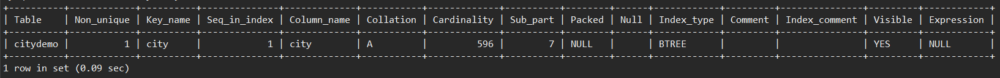
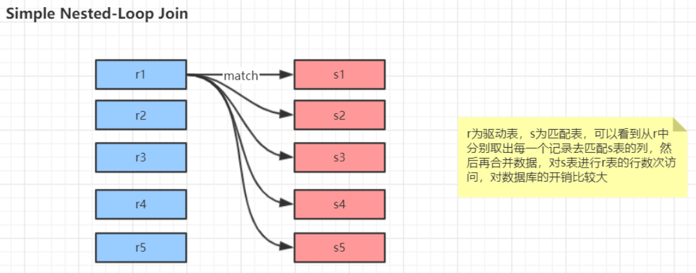
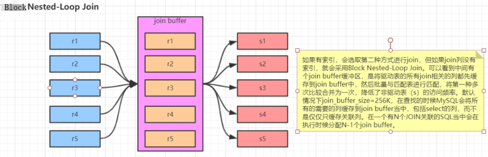
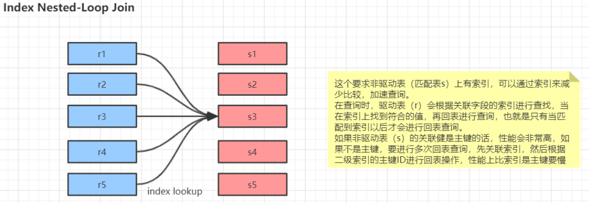
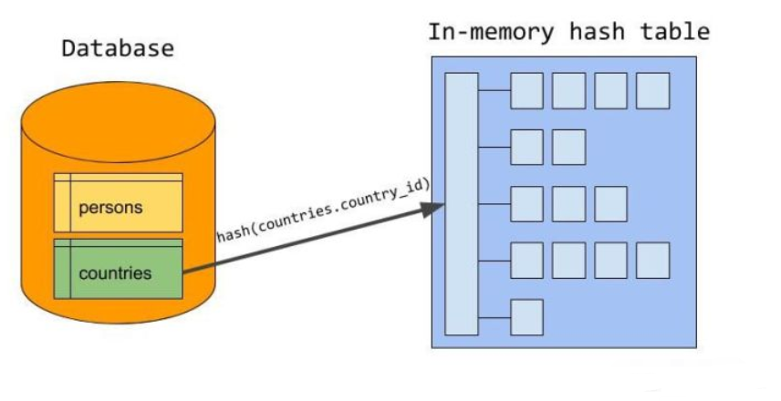
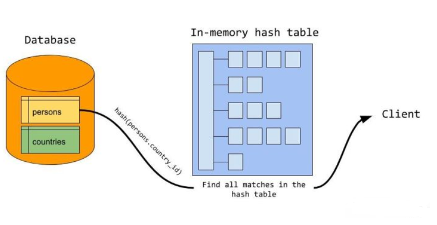
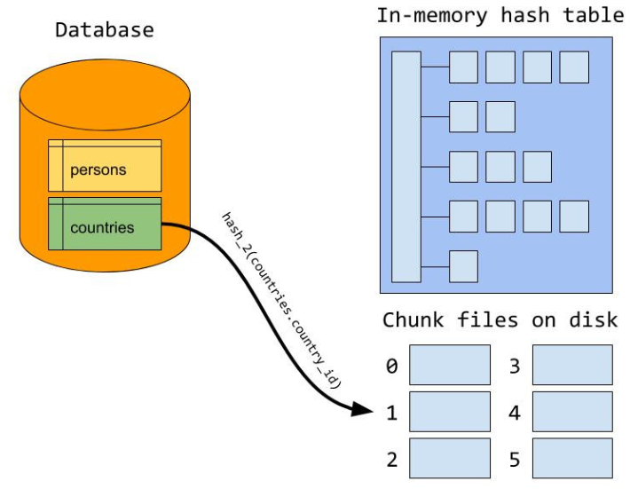
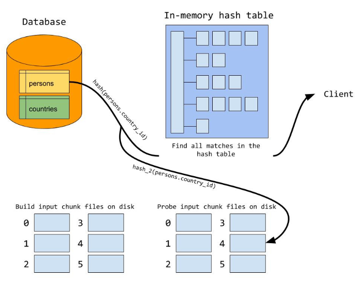
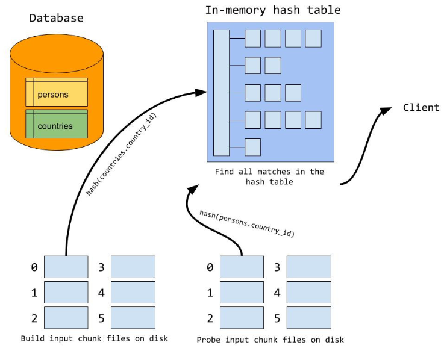

# 4.索引优化

## 优化细节点

### 1. 避免表达式

当使用索引列进行查询的时候尽量不要使用表达式，把计算放到业务层而不是数据库层。表达式会导致索引失效

```mysql
mysql> explain select * from it where id + 1 = 3;
+----+-------------+-------+------------+------+---------------+------+---------+------+------+----------+-------------+
| id | select_type | table | partitions | type | possible_keys | key  | key_len | ref  | rows | filtered | Extra       |
+----+-------------+-------+------------+------+---------------+------+---------+------+------+----------+-------------+
|  1 | SIMPLE      | it    | NULL       | ALL  | NULL          | NULL | NULL    | NULL |    4 |   100.00 | Using where |
+----+-------------+-------+------------+------+---------------+------+---------+------+------+----------+-------------+
1 row in set (0.06 sec)

mysql> explain select * from it where id = 2;
+----+-------------+-------+------------+-------+---------------+---------+---------+-------+------+----------+-------+
| id | select_type | table | partitions | type  | possible_keys | key     | key_len | ref   | rows | filtered | Extra |
+----+-------------+-------+------------+-------+---------------+---------+---------+-------+------+----------+-------+
|  1 | SIMPLE      | it    | NULL       | const | PRIMARY       | PRIMARY | 4       | const |    1 |   100.00 | NULL  |
+----+-------------+-------+------------+-------+---------------+---------+---------+-------+------+----------+-------+
1 row in set (0.07 sec)
```

### 2. 利用主键查询

尽量使用主键查询而不是其他索引，因为主键查询不会触发回表

### 3. 利用前缀索引

有时候需要对很长的字符串建索引，这会让索引变的大且慢，通常情况下可以使用某个列开始的部分字符串，这样大大的节约索引空间，从而提高索引效率，但这会降低索引的选择性，索引的选择性是指不重复的索引值和数据表记录总数的比值。索引的选择性越高则查询效率越高，因为选择性更高的索引可以让mysql在查找的时候过滤掉更多的行。

一般情况下某个列前缀的选择性也是足够高的，足以满足查询的性能，但是对应`BLOB`，`TEXT`，`VARCHAR`类型的列，必须要使用前缀索引，因为mysql不允许索引这些列的完整长度，使用该方法的重点在于**要选择足够长的前缀以保证较高的选择性，但又不能太长而影响效率**。

```mysql
-- 1. 查询不同前缀长度下的索引选择性如何，值越接近sel_origin说明选择性越好
mysql> select count(distinct left(city,3))/count(*) as sel3,
count(distinct left(city,4))/count(*) as sel4,
count(distinct left(city,5))/count(*) as sel5,
count(distinct left(city,6))/count(*) as sel6,
count(distinct left(city,7))/count(*) as sel7,
count(distinct left(city,8))/count(*) as sel8, 
count(distinct left(city,9))/count(*) as sel9, 
count(distinct left(city,10))/count(*) as sel10, 
count(distinct city)/count(*) as sel_origin
from citydemo;
+--------+--------+--------+--------+--------+--------+--------+--------+------------+
| sel3   | sel4   | sel5   | sel6   | sel7   | sel8   | sel9   | sel10  | sel_origin |
+--------+--------+--------+--------+--------+--------+--------+--------+------------+
| 0.0239 | 0.0293 | 0.0305 | 0.0309 | 0.0310 | 0.0310 | 0.0310 | 0.0311 | 0.0312     |
+--------+--------+--------+--------+--------+--------+--------+--------+------------+

-- 2. 选择合适的前缀长度，创建出前缀索引
mysql> alter table citydemo add key(city(7));
Query OK, 0 rows affected (0.08 sec)
Records: 0  Duplicates: 0  Warnings: 0

-- 3. 查询索引，结果如下面图片，说明前缀索引创建成功
mysql> show index from citydemo;
```



> 索引中`Cardinality`代表"基数"，意思是该列值去重后的个数，这是一个预估值。
>
> "基数"是一个通用的概念，在其他地方可能也会见到。

前缀索引是一种能使索引更小更快的有效方法，但是也包含一些缺点：无法使用前缀索引做 order by 和 group by 等操作

### 4. 利用索引完成排序

mysql有两种方式可以生成有序的结果：通过排序操作或者按索引顺序扫描，如果`explain`出来的`type`列的值为`index`，则说明mysql使用了索引扫描来做排序

扫描索引本身是很快的，因为只需要从一条索引记录移动到紧接着的下一条记录。但如果索引不能覆盖查询所需的全部列，那么就不得不每扫描一条索引记录就回表查询一次对应的行，这基本都是随机IO，因此按索引顺序读取数据的速度通常要比顺序地全表扫描慢

mysql可以使用同一个索引即满足排序，又用于查找行。如果可能的话，设计索引时应该尽可能地同时满足这两种任务

只有当索引的列顺序和`order by`子句的顺序完全一致，并且所有列的排序方式都一样时，mysql才能够使用索引来对结果进行排序。如果查询需要关联多张表，则只有当`order by`子句引用的字段全部为第一张表时，才能使用索引做排序。`order by`子句和查找型查询的限制是一样的，需要满足索引的最左前缀的要求，否则mysql都需要执行顺序操作，而无法利用索引排序

```sql
-- 表it有id、a、b、c、d、e列，类型都使int。其中id是自增主键，有一个(a，b，c)的联合索引
-- 通过该表检测合适能用索引完成排序

-- 会用索引排序的情况
explain select id,a,b from it order by a,b;
explain select id,a,b from it order by a,b,c;
-- 符合最左匹配，a 和 b 方向一样
explain select id,a,b from it order by a desc, b desc;
-- 符合最左匹配，a是等值查询
explain select id,a,b from it where a = 1 order by b, c;
-- a是范围查询，可以用 a 和 b的索引排序
explain select id,a,b from it where a > 1 order by a, b;

-- 不会用索引排序的情况
explain select id,a,b from it order by a,c;
-- a和b的排序方式不一样，不会用索引排序
explain select id,a,b from it order by a asc, b desc;
-- 不符合最左匹配
explain select id,a,b from it order by b, c;
-- a是范围查询，无法用 b 和 c的索引排序
explain select id,a,b from it where a > 1 order by b, c;
-- 包含非索引列的排序情况
explain select id,a,b,e from it where a > 1 order by a, e;
```

### 5. union all，in，or

`union all`，`in`和`or`都有类似的作用，但是**建议使用`in`**。

`union all`使用两条sql，效率肯定比较低

```mysql
mysql> explain select * from actor where actor_id = 1 union all select * from actor where actor_id = 2;
+----+-------------+-------+------------+-------+---------------+---------+---------+-------+------+----------+-------+
| id | select_type | table | partitions | type  | possible_keys | key     | key_len | ref   | rows | filtered | Extra |
+----+-------------+-------+------------+-------+---------------+---------+---------+-------+------+----------+-------+
|  1 | PRIMARY     | actor | NULL       | const | PRIMARY       | PRIMARY | 2       | const |    1 |   100.00 | NULL  |
|  2 | UNION       | actor | NULL       | const | PRIMARY       | PRIMARY | 2       | const |    1 |   100.00 | NULL  |
+----+-------------+-------+------------+-------+---------------+---------+---------+-------+------+----------+-------+
2 rows in set (0.07 sec)
```

从执行计划上看，`or`和`in`一样。但是从`show profiles;`可以看出耗费时间有差别

```mysql
mysql> explain select * from actor where actor_id in (1,2);
+----+-------------+-------+------------+-------+---------------+---------+---------+------+------+----------+-------------+
| id | select_type | table | partitions | type  | possible_keys | key     | key_len | ref  | rows | filtered | Extra       |
+----+-------------+-------+------------+-------+---------------+---------+---------+------+------+----------+-------------+
|  1 | SIMPLE      | actor | NULL       | range | PRIMARY       | PRIMARY | 2       | NULL |    2 |   100.00 | Using where |
+----+-------------+-------+------------+-------+---------------+---------+---------+------+------+----------+-------------+
1 row in set (0.06 sec)

mysql>  explain select * from actor where actor_id = 1 or actor_id =2;
+----+-------------+-------+------------+-------+---------------+---------+---------+------+------+----------+-------------+
| id | select_type | table | partitions | type  | possible_keys | key     | key_len | ref  | rows | filtered | Extra       |
+----+-------------+-------+------------+-------+---------------+---------+---------+------+------+----------+-------------+
|  1 | SIMPLE      | actor | NULL       | range | PRIMARY       | PRIMARY | 2       | NULL |    2 |   100.00 | Using where |
+----+-------------+-------+------------+-------+---------------+---------+---------+------+------+----------+-------------+
1 row in set (0.07 sec)
```

- 如果要匹配的列上有索引，此时`or`和`in`差别不大（我猜测是拿目标值根据索引找对应行数据）
- 如果要匹配的列没有索引，此时会先遍历一遍所有值，然后判断值是否满足条件。
  - 使用`or`时，会将值与目标值依次匹配，时间复杂度O(n)
  - 使用`in`时，MySQL进行了优化，如果`in()`中的值不需要类型转换，此时会先将括号中的列表值进行排序，然后根据二分查找去匹配，时间复杂度O(logn)

### 6. 范围列对索引的影响

范围查询（<、>、>=、<=、<>、!=、between等）和等值查询在索引使用方面略有区别：

1. 范围查询的那一列是可以用到索引的
2. 范围查询列的后面列就无法用索引了，范围查询的列会破坏最左匹配，发生了范围查询就不满足最左匹配了

### 7. 注意强制类型转换

强制类型转转换时不会使用索引，会进行全表扫描

```mysql
-- e列是char类型，没有类型转换时会使用索引
mysql> explain select * from it where e  = '3';
+----+-------------+-------+------------+------+---------------+-----+---------+-------+------+----------+-------+
| id | select_type | table | partitions | type | possible_keys | key | key_len | ref   | rows | filtered | Extra |
+----+-------------+-------+------------+------+---------------+-----+---------+-------+------+----------+-------+
|  1 | SIMPLE      | it    | NULL       | ref  | e             | e   | 30      | const |    1 |   100.00 | NULL  |
+----+-------------+-------+------------+------+---------------+-----+---------+-------+------+----------+-------+
1 row in set (0.06 sec)

-- 有类型转换时不会使用索引，type为ALL说明会进行全表扫描
mysql> explain select * from it where e  = 3;
+----+-------------+-------+------------+------+---------------+------+---------+------+------+----------+-------------+
| id | select_type | table | partitions | type | possible_keys | key  | key_len | ref  | rows | filtered | Extra       |
+----+-------------+-------+------------+------+---------------+------+---------+------+------+----------+-------------+
|  1 | SIMPLE      | it    | NULL       | ALL  | e             | NULL | NULL    | NULL |    5 |    20.00 | Using where |
+----+-------------+-------+------------+------+---------------+------+---------+------+------+----------+-------------+
1 row in set (0.07 sec)
```

### 8. 什么列不适合索引

不是每个列都适合建立索引，建立索引时要避免以下情况的列：

- 更新十分频繁：会导致频繁更新B+树索引，维护成本大影响效率
- 数据区分度不高：区分度不高的属性建立索引意义不大，不能有效的过滤数据

一般区分度在80%以上的时候就可以建立索引，区分度可以使用`count(distinct(列名))/count(*)`来计算

### 9. 索引列尽量非空

创建索引的列，尽量不允许值为null。null值会让MySQL进行额外的判断和处理，有时还可能会得到不符合预期的结果

### 10. 注意多表join

当需要进行表连接的时候，最好不要超过三张表。需要`join`的字段，数据类型必须一致

多张大数据量的表`join`时，会产生类似笛卡尔积的效果，非常耗资源

#### join原理

`join`表关联使用的是`Nested-Loop`算法（循环嵌套），两张表 a 和 b 进行 join 时，MySQL会自己优化选择先读哪张表后读哪张表，先读的表在for循环的外层，也叫驱动表；后读的表在for循环的内层，也叫匹配表

1、当`join`的列没有索引，匹配表大小超过`join_buffer_size`大小时，此时就不会把表读进缓冲区，而是每次从磁盘读取。此时时间复杂度是O(m*n)。这种情况也叫 **Simple Nested-Loop Join** 算法



2、当`join`的列没有索引时，匹配表大小不超过系统配置`join_buffer_size`大小时，会先将驱动表读到 join buffer 里，然后批量对匹配表进行匹配，降低了匹配表的访问频率。假设驱动表大小是m，匹配表大小是n，此时时间复杂度可以认为是O(n)，而不是O(m*n)。这种情况也叫 **Block Nested-Loop Join** 算法



这种方式有一些细节要注意：

- Join Buffer 会缓存所有参与查询的列而不是只有Join的列
- 可以通过`join_buffer_size` 调整缓存大小
- `join_buffer_size`默认值是256K，`join_buffer_size`的最大值在MySQL 5.1.22版本前是4G-1，之后的版本才能在64位操作系统下申请大于4G的Join Buffer空间
- 使用 Block Nested-Loop Join 算法需要开启相关系统配置，`set global optimizer_switch="block_nested_loop=on";`，默认即为开启

> 从 MySQL 8.0.18 开始支持了`hash join`，因此Block Nested-Loop Join 算法也被 Hash Join 算法替代了
>
> 关于`hash join`，用单独的一小节来聊。因为是 MySQL 最新的特性，所以面试时可以尽情表现

3、当`join`的列在匹配表里有索引时，情况又不一样了。驱动表会拿每个值使用索引去匹配匹配表上的值，加速查询。这种情况也叫 **Index Nested-Loop Join** 算法



第二种局限性较多，第三种是在大部分场景都能利用上的。

这种情况是效率极高的：**小表 join 大表，大表的 join 列有索引，且最好是主键索引**

`select * from emp e join dept d on e.deptno = d.deptno`

### 11. 利用limit

能使用`limit`的时候尽量使用`limit`，`limit`用于限制输出，当达到`limit`限制的数量后就直接返回，不再处理后续数据

### 12. 单表索引数

单表索引数量建议控制在5个以内，太多的索引会导致磁盘空间的浪费

这只是一个建议，如果实际场景下确实需要很多索引，建立多个索引也无所谓

### 13. 注意组合索引长度

建立组合索引时，组合的列要尽量避免超过5个。因为有最左匹配的规则，索引组合索引列非常多时，只有把每个列都给出合理限制才能很好的利用该组合索引，实际上这是不太现实的。

### 14. 避免误区

- 索引越多越好
- 过早优化，在不了解系统的情况下进行优化

## 索引监控

通过`show status like 'Handler_read%';`命令可以查看索引的使用情况

```mysql
mysql> show status like 'Handler_read%';
+-----------------------+-------+
| Variable_name         | Value |
+-----------------------+-------+
| Handler_read_first    | 37    |
| Handler_read_key      | 801   |
| Handler_read_last     | 2     |
| Handler_read_next     | 1208  |
| Handler_read_prev     | 22    |
| Handler_read_rnd      | 232   |
| Handler_read_rnd_next | 9939  |
+-----------------------+-------+
7 rows in set (0.06 sec)
```

这些字段都是针对索引使用情况的，如果完全没使用到索引，那么全部字段值都是0

字段说明：

- `Handler_read_first`：读取索引根节点的次数
- `Handler_read_key`：通过`index`获取数据的次数，值越大说明索引利用率越高，情况越好（重要指标）
- `Handler_read_last`：读取索引最后一个条目的次数，该字段值和`ORDER BY xxx DESC`挂钩
- `Handler_read_next`：按键顺序读取下一行的请求数，值越大说明通过索引进行范围查询的情况多
- `Handler_read_prev`：通过索引读取上一条数据的次数，该字段值和`ORDER BY xxx DESC`挂钩
- `Handler_read_rnd`：从固定位置读取数据的次数，值越大代表执行了很多需要对结果进行排序的查询，可能有很多全表扫描的情况，越小越好
- `Handler_read_rnd_next`：从数据节点读取下一条数据的次数，值越大说明进行了越多的表扫描，越小越好

## 索引优化分析案例

预先准备好数据

```sql
SET FOREIGN_KEY_CHECKS=0;
DROP TABLE IF EXISTS `itdragon_order_list`;
CREATE TABLE `itdragon_order_list` (
  `id` bigint(11) NOT NULL AUTO_INCREMENT COMMENT '主键id，默认自增长',
  `transaction_id` varchar(150) DEFAULT NULL COMMENT '交易号',
  `gross` double DEFAULT NULL COMMENT '毛收入(RMB)',
  `net` double DEFAULT NULL COMMENT '净收入(RMB)',
  `stock_id` int(11) DEFAULT NULL COMMENT '发货仓库',
  `order_status` int(11) DEFAULT NULL COMMENT '订单状态',
  `descript` varchar(255) DEFAULT NULL COMMENT '客服备注',
  `finance_descript` varchar(255) DEFAULT NULL COMMENT '财务备注',
  `create_type` varchar(100) DEFAULT NULL COMMENT '创建类型',
  `order_level` int(11) DEFAULT NULL COMMENT '订单级别',
  `input_user` varchar(20) DEFAULT NULL COMMENT '录入人',
  `input_date` varchar(20) DEFAULT NULL COMMENT '录入时间',
  PRIMARY KEY (`id`)
) ENGINE=InnoDB AUTO_INCREMENT=10003 DEFAULT CHARSET=utf8;

INSERT INTO itdragon_order_list VALUES ('10000', '81X97310V32236260E', '6.6', '6.13', '1', '10', 'ok', 'ok', 'auto', '1', 'itdragon', '2017-08-28 17:01:49');
INSERT INTO itdragon_order_list VALUES ('10001', '61525478BB371361Q', '18.88', '18.79', '1', '10', 'ok', 'ok', 'auto', '1', 'itdragon', '2017-08-18 17:01:50');
INSERT INTO itdragon_order_list VALUES ('10002', '5RT64180WE555861V', '20.18', '20.17', '1', '10', 'ok', 'ok', 'auto', '1', 'itdragon', '2017-09-08 17:01:49');

```

逐步开始进行优化：

第一个案例：

```sql
select * from itdragon_order_list where transaction_id = "81X97310V32236260E";
--通过查看执行计划发现type=all,需要进行全表扫描
explain select * from itdragon_order_list where transaction_id = "81X97310V32236260E";

--优化一、为transaction_id创建唯一索引
 create unique index idx_order_transaID on itdragon_order_list (transaction_id);
--当创建索引之后，唯一索引对应的type是const，通过索引一次就可以找到结果，普通索引对应的type是ref，表示非唯一性索引赛秒，找到值还要进行扫描，直到将索引文件扫描完为止，显而易见，const的性能要高于ref
 explain select * from itdragon_order_list where transaction_id = "81X97310V32236260E";
 
 --优化二、使用覆盖索引，查询的结果变成 transaction_id,当extra出现using index,表示使用了覆盖索引
 explain select transaction_id from itdragon_order_list where transaction_id = "81X97310V32236260E";
```

第二个案例

```sql
--创建复合索引
create index idx_order_levelDate on itdragon_order_list (order_level,input_date);

--创建索引之后发现跟没有创建索引一样，都是全表扫描，都是文件排序
explain select * from itdragon_order_list order by order_level,input_date;

-- 可以使用force index强制指定索引
explain select * from itdragon_order_list force index(idx_order_levelDate) order by order_level,input_date;

--其实给订单排序意义不大，给订单级别添加索引意义也不大，因此可以先确定order_level的值，然后再给input_date排序
explain select * from itdragon_order_list where order_level=1 order by input_date;

-- 通过 profiles 和 last_query_cost，可以发现上面三条语句，从上往下耗时越来越少
```


## hash join

MySQL 8.0.18 版本增加了一个新的特性`hash join`，这是一个很新的特性，比`nested loop` 算法更高效

### join流程

以一个 sql 语句为例：

```sql
select * from persons join countries on persons.country_id = countries.country_id
```

`hash join`分为2个阶段：

- `build` 构建阶段
- `probe` 探测阶段

#### 构建阶段

从参与 join 的两个表中选出占用空间小的表（注意不是行数少的），这里选择 countries 表，对 countries 表里要 join 的列进行 hash 计算：

```
hash(countries.country_id);
```

计算出结果后，放到内存中 hash table 相应位置。所有行都放到 hash table 里后，构建阶段完成。



#### 探测阶段

对另一个表 persons 中 join 列值计算 hash

```
hash(persons.country_id)
```

拿着计算结果到内存 hash table 中进行查找匹配，找到一行就返回给 client

这样就完成了整个 join 操作，每个表只扫描一次就可以了，扫描匹配时间也是恒定的，非常高效



在之前的流程中，是假设了 countries 表顺利全部放入内存的，可用内存大小可以通过`join_buffer_size`控制。

如果 countries 表很大，超过可用内存时，需要溢出到磁盘里

#### 溢出到磁盘

在构建阶段过程中，如果内存满了，会把表中剩余数据写到磁盘上

不会只写入一个文件，会分成多个块文件。MySQL会考虑每个文件写多少内容，以使一个文件内容恰好适合可用内存大小

怎么决定某一行记录写入哪个块文件呢？也是通过 hash 计算 join 字段决定的，但是这里的 hash 函数和之前写入内存时用到的 hash 函数不是一个：

```
hash_2(countries.country_id)
```



可以看到，对于大表，构建阶段分为了2步：

- 写入内存 hash table
- 写入块文件

然后是探测阶段，首先还是会走一遍和之前一样的流程，就是通过hash计算要匹配列的哈希值，然后和内存中的 hash table 进行匹配。

但因为内存中的 hash table 不是全部数据，所以需要额外的处理：

把 `persons` 表的数据也写入多个块文件中。

怎么决定某一行记录写入哪个块文件呢？和构建阶段写入块文件的思路相同，通过 hash_2 函数计算哈希值，这样构建阶段的块文件和此处的块文件就是一一对应的关系了



在正常的探测流程走完之后，开始处理块文件中的内容了

逐一加载构建阶段的块文件到内存中，加载过程和正常的构建过程一致，对块文件中的每行数据进行 hash 计算，放入内存的 hash table 中

构建好一个块文件之后，选择与其对应的探测块文件开始探测，例如探测构建阶段第0个块文件时，就选择第0个探测块文件，直到所有对块文件都已处理为止



为什么放入缓存时是用的 hash 函数和写入文件时用到的 hash 函数不一样？因为如果两个 hash 函数一样，那么将构建块文件加载到 hash 表时会得到一个糟糕的 hash table，因为同一块文件中的所有行都将哈希成相同的值

### 如何使用和配置

在 MySQL 8.0.18中，当需要对没有索引的列进行`join`时，就会自动优化成`hash join`

```mysql
-- 通过执行计划查看 hash join，只有指定"format=tree"时才能看到
mysql> explain format=tree SELECT * FROM t1 JOIN t2 ON t1.c1 = t2.c1\G                                 *************************** 1. row ***************************
EXPLAIN: -> Inner hash join (t2.c1 = t1.c1)  (cost=0.70 rows=1)
    -> Table scan on t2  (cost=0.35 rows=1)
    -> Hash
        -> Table scan on t1  (cost=0.35 rows=1)
```

可以通过`set optimizer_switch="hash_join=off"`来关闭`hash join`，默认是开启的

当加载到内存中的数据超过内存可用容量时，mysql 会使用磁盘文件来处理。当使用的文件数超出`open_files_limit`配置值时，`hash join`会失败，此时解决方案有两个：

- 增加`join_buffer_size`以使`hash join`不会溢出到磁盘或者溢出的量不超过文件最大限制
- 增加`open_files_limit`

### 局限性

当前`hash join`的实现存在一些限制：

- 只对内连接支持，当使用外连接时将无法使用`hash join`
- 只对要`join`的列没有索引时有效
- 只在等值连接时有效，因为`hash`算法本身就不支持范围查询
- 优化器会将`hash join`判定为`block nested loop join`


参考：[hash join原理](https://mysqlserverteam.com/hash-join-in-mysql-8/)

